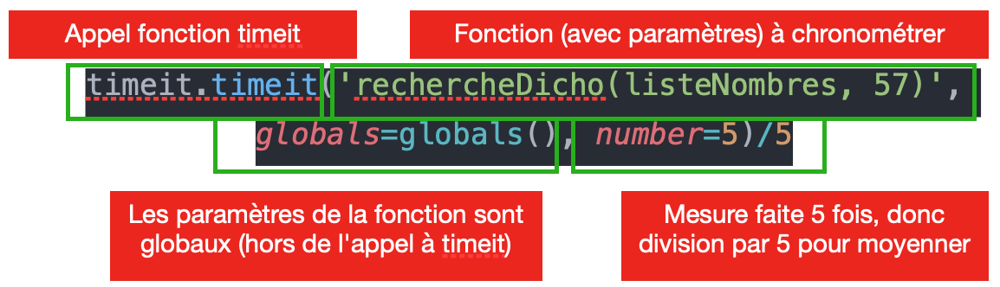

# Algorithmes de recherche

Peut-on trouver en moins de 20 coups un mot dans un dictionnaire contenant un million de mots ? Nous allons voir que la réponse est oui !

La recherche d'un élément dans un tableau est une opération en apparence simple et rapide. Toutefois, au prix d'un petit effort d'abstraction, on peut accélérer la recherche d'un élément et atteindre des niveaux d'efficacité supérieurs.

Cet algorithme est **fondamental** en informatique.


## Algorithme naïf

Écrire une fonction `#!python recherche_naive` qui recherche si un entier nommé `élément_recherché` est contenu dans un tableau d'entiers `tableau`. Cette fonction prend deux paramètres :

- le tableau `tableau` ;
- l'entier recherché `élément_recherché`.
	
Cette fonction  renvoie :

- -1 si `élément_recherché` n'est pas contenu dans `tableau` ;
- le nombre d'étapes pour trouver l'`élément_recherché` sinon.

_Remarque_ : On s'interdit l'usage de la fonciton `#!python in`.

{{IDE('algo1/exo2')}}

!!! question "Complexité..."

    - Combien d'opérations seront effectuées dans le pire des cas ? 
    - Ce nombre d'opérations est-il validé par le nombre d'étapes indiqué par votre programme ?


## Algorithme de recherche dichotomique

On donne l'algorithme de recherche dichotomique dans une liste triée :

```bash linenums="1"
DONNÉES
t : tableau d'entiers trié
x : nombre entier, entier recherché


DEBUT
trouve ← FAUX
i_deb ← 0
i_fin ← longueur(t)-1
tant que trouve == FAUX et que i_deb ⩽ i_fin :
    mil ← partie_entière((i_deb+i_fin)/2)
    si t[mil] == x :
         trouve = vrai
    sinon :
         si x > t[mil] :
             i_deb ← mil+1
         sinon :
             i_fin ← mil-1
         fin si
      fin si
fin tant que

renvoyer la valeur de trouve
```

!!! question "Comprendre l'algorithme"

    - À l'aide du papier, d'un crayon et de la méthode du cours, appliquez cet algorithme en recherchant l'entier 5 sur le tableau `#!python [1, 2, 5, 9, 10, 14, 17, 24, 41]`; 
    - Refaire le travail avec l'élément 5 sur la liste `#!python [4, 8, 13, 23, 24, 26, 30, 32, 37, 43, 44, 48, 64, 70, 83, 89, 90]`.
    - Grâce à cet exemple et au schéma ci-dessous, sur votre cours, décrire le principe général de fonctionnement de cet algorithme. 

    { align=center }


!!! exo "Écrire l'algorithme"

    Dans l'IDE ci-dessous, traduire cet algorithme en langage Python en complétant la fonction recherche_dichotomique.

    _Aide_ : N'oubliez pas de valider votre fonction avec le bouton de validation...

    {{IDE('algo1/exo1', MAX = 1000)}}
        
    Modifier votre fonction afin de :

    - renvoyer -1 si l'entier recherché n'appartient pas au tableau ;
    - renvoyer le nombre d'étapes pour trouver l'entier sinon.


!!! question "Complexité..."

    - Quel est le pire des cas pour cet algorithme ?
    - À l'aide de tests sur des tableaux de plus en plus grands, essayer de trouver la complexité de cet algorithme dans le pire des cas.

        _Rappel_ : on pourra créer des tableaux en utilisant la notation en compréhension : `#!python T = [ i for i in range(taille) ]`.

    - Ce deuxième algorithme est-il plus efficace que le premier ? Avec vos propres mots et en utilisant le schéma ci-contre, expliquez pourquoi.
  
## Comparaison d'algorithmes

Cette partie est à réaliser en local sur Thonny. 

La librairie `#!python timeit` permet de faire des mesures de vitesse d'exécution. Pour cela, il faut d'abord l'importer à l'aide de l'instruction `#!python import timeit`.

`#!python timeit` s'utilise comme suit : 

{ align=center }

- Créer des tableaux de taille 100, 1000, 10000.
- Réaliser et afficher quelques mesures de temps d'exécution de votre algorithme naïf ainsi que de votre algorithme de recherche par dichotomie sur ces tableaux.
- Modifier votre programme de manière à enregistrer les résultats des mesures de temps dans deux variables : `#!python temps_naif` et `#!python temps_dichotomique`.

!!! example "Exemple de résultat"

    ```python
    taille_tableau = [ 10, 100, 1000, 10000 ]
    temps_naif = []
    temps_dichotomique = []
    # Mesure de temps de calcul 
    # Obtention des résultats.
    temps_naif = [ 0.0001 , 0.01, 0.1, 1.2 ]
    temps_dichotomique = [ 0.0001 , 0.001, 0.01, 0.2 ]
    ```

- On peut réaliser des graphiques grâce à une librairie appelée matplotlib. À l'aide d'une recherche, trouver comment fonctionne matplotlib. Nous aurons besoin de l'importation : `#!python from matplotlib.pyplot import *`. 
- Réaliser un graphique représentant vos mesures de temps pour les deux algorithmes en fonction de la taille du tableau. On pourra utiliser une échelle logarithmique en abscisse et en ordonnées.