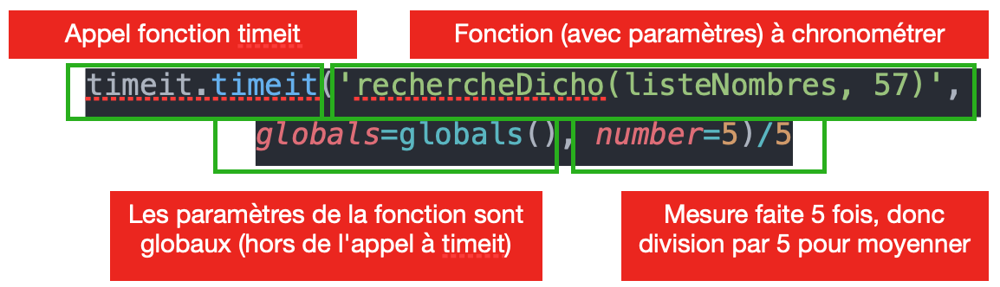

# Algorithmes de tri : tri par sélection

Nous avons vu que la recherche dichotomique permettait de rechercher de manière très efficace un élément **dans une liste triée**.

Cet algorithme va donc être utile si nous disposons d'un algorithme de tri capable de faire son travail rapidement (si possible en complexité logarithmique). Mais un tel algorithme n'est vu qu'en Terminale... 

Pour vous donner une idée, allez voir le [nombre d'algorithmes](https://fr.wikipedia.org/wiki/Algorithme_de_tri) de tri existant.

La problématique du tri est encore aujourd'hui largement étudiée en recherche informatique. Toute personne travaillant dans le domaine de l'informatique est amenée à étudier sur ce type d'algorithme. Nous verrons cette année deux algorithmes de tri :

- le tri par sélection ;
- le tri par insertion.

## Algorithme naïf

!!! question "Question 1"

    Regardez la [vidéo liée](https://www.youtube.com/watch?v=cVMKXKoGu_Y) afin de comprendre son fonctionnement dans le cas où on recherche l'objet le plus lourd.
    

!!! question Question 2

    Nous allons représenter les boites de la vidéo par un tableau de nombres dont les valeurs correspondent aux poids des pièces.

    Sur une feuille, compléter l'algorithme en pseudo-code suivant :
    
    ```bash
    Paramètres d'entrée : 
    tas_des_poids = ensemble des poids non triés
    tas_des_poids_triés = ensemble des poids triés

    Début :
    On parcourt … … … … … … … … … … … … … … … … … :
        on trouve  … … … … … … … … … … …     
        on l'enregistre dans tas_des_poids_triés.

    On renvoie … … … … … … … … …
    ```

    Pour des raisons de simplicité d'écriture, nous allons chercher **l'élément le plus léger**. 
    
!!! question "Question 3"

    Commenter chaque ligne de la fonction `#!python tri_sélection_simple` en la reliant à une étape de l'algorithme.

    {{IDE("algo2/exo1", MAX = 1000)}}

!!! question "Question 4"

    La fonction `#!python trouver_plus_leger` ci-dessus doit être programmée. Cette fonction prend en paramètres d'entrée un tableau de nombres entiers `liste_de_poids` ainsi qu'un indice qui nous servira plus tard.
    
    Elle renvoie la position du minimum de ce tableau. On s'interdira l'utilisation de la fonction Python `#!python min`.


## Algorithme : tri par sélection

L'algorithme précédent a l'inconvénient d'utiliser deux tableaux, ce qui est inefficace en terme de coût mémoire. On se propose de trouve une méthode permettant de n'utiliser qu'un seul tableau.

!!! question "Question 5"

    À partir du tableau ci-dessous, schématisant le tri par sélection, expliquez ce qu'il se passe à chaque étape. On considère un tas de 4 poids. 
    
    |Passage 0 dans boucle|33|81|21|51| On trouve 21 pour minimum. Il est en position 2. On va inverser le 33 et le 21|
    |-|-|-|-|-|:-|
    |Passage 1 dans boucle|21|81|33|51| ..... |
    |Passage 2 dans boucle|21|33|81|51| ..... |
    |Passage 3 dans boucle|21|33|51|81| ..... |


    En déduire quelle pourrait être la méthode nous permettant de nous passer d'un tableau par rapport à la méthode naïve.

!!! question "Question 6"

    À partir du tableau précédent, répondez à ces questions importantes :

    - combien de passage(s) dans la boucle contient cet algorithme ?
    - la recherche d'un minimum se fait-elle systématiquement dans tout le tableau ? Si non, à une étape quelconque k, à partir de quel position doit-on chercher le minimum ?
    - quelle valeur est toujours échangée ?

!!! question "Question 7"
    
    À partir de vos réponses, complétez l'algorithme ci-dessous : 

    ```bash
    Paramètres d'entrée : 
    tas_des_poids = ensemble des poids non triés

    Début :
    On parcourt … … … … … … … … … … … … … … … … … :
        on enregistre  … … … … … … … … … … …     
        on … … … … … … … … … … …  
        on … … … … … … … … … … …  

    On renvoie … … … … … … … … …
    ```

!!! question "Question 8"
    
    Pour que notre nouvel algorithme fonctionne, modifier la fonction `trouver_plus_léger`. 

    Celle-ci doit maintenant trouver le minimum d'un tableau `#!python liste_de_poids` pour des éléments compris entre la position `#!python i_debut` et la fin du tableau. On utilisera le paramètre optionnel `#!python i_debut`.

    __Aide__ : l'instruction range(a, b) permet de compter de a à b-1.

    {{IDE("algo2/exo2", MAX = 1000)}}

!!! question "Question 9"

    À partir de l'algorithme de la question 3 et en utilisant la nouvelle version de la fonction `trouver_plus_léger`, compléter la fonction triSelection. 

    __Aide__ : pour utiliser un paramètre optionnel, il suffit de lui donner une valeur.

    ???+ example "Exemple"  

        `#!python trouver_plus_léger([11,18,8,63])` trouve la plus petite valeur depuis l'indice 0 (valeur par défaut 0), donc entre 11, 18, 8 et 63 ;
        `#!python trouver_plus_léger([11,18,8,63], 2)` trouve la plus petite valeur depuis l'indice 2, donc entre 8 et 63.

    {{IDE("algo2/exo3", MAX = 1000)}}

    N'oubliez pas de tester votre algorithme sur quelques exemples.


## Algorithme : complexité et mesure de temps

!!! Question "Question 10"

    - [ ] Quelle sera la complexité de notre algorithme dans les cas suivants : 
    liste = [4, 2, 8, 7, 9, 3, 11] 
    liste = [11, 8, 6, 4, 2, 1]
    liste = [1, 4, 5, 6, 9, 13]

    - [ ] En déduire quel est le pire des cas puis donner la complexité de l'algorithme en notation O.


Cette partie est à réaliser en local sur Thonny. 

La librairie `#!python timeit` permet de faire des mesures de vitesse d'exécution. Pour cela, il faut d'abord l'importer à l'aide de l'instruction `#!python import timeit`.

`#!python timeit` s'utilise comme suit : 

{ align=center }

- Créer des tableaux de taille 100, 1000, 10000.
- Réaliser et afficher quelques mesures de temps d'exécution de votre algorithme naïf ainsi que de votre algorithme de recherche par dichotomie sur ces tableaux.
- Modifier votre programme de manière à enregistrer les résultats des mesures de temps dans deux variables : `#!python temps_naif` et `#!python temps_sélection`.

!!! example "Exemple de résultat"

    ```python
    taille_tableau = [ 10, 100, 1000, 10000 ]
    temps_naif = []
    temps_sélection = []
    # Mesure de temps de calcul 
    # Obtention des résultats.
    temps_naif = [ 0.0001 , 0.01, 0.1, 1.2 ]
    temps_dichotomique = [ 0.0001 , 0.001, 0.01, 0.2 ]
    ```

- On peut réaliser des graphiques grâce à une librairie appelée matplotlib. À l'aide d'une recherche, trouver comment fonctionne matplotlib. Nous aurons besoin de l'importation : `#!python from matplotlib.pyplot import *`. 
- Réaliser un graphique représentant vos mesures de temps pour les deux algorithmes en fonction de la taille du tableau. On pourra utiliser une échelle logarithmique en abscisse et en ordonnées.