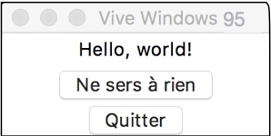
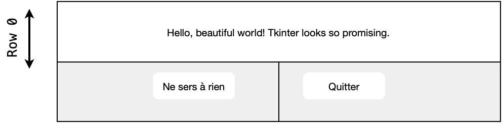

# Introduction aux GUI (Graphical User Interface) et à la programmation événementielle

## Une courte introduction

`#!python tkinter` est un module de « gadgets graphiques » (widgets - contraction de window et gadget) intégré par défaut dans Python et d’une grande simplicité.

Il existe d'autres bibliothèques de ce type (`#!python wxPython`, `#!python pyQT`, `#!python pygame`...).

Un manuel de référence sur `#!python tkinter` (168 pages en anglais !) est disponible sur Internet (google : `#!python tkinter` reference guide).

Le principe général est :

- [ ] de créer une fenêtre graphique ;
- [ ] puis de placer et organiser des éléments (boutons, textes, zones de dessin, etc...) à l'intérieur de cette fenêtre.

!!! help "Syntaxe"
    
    Tous les éléments (fenêtre graphique comprise) sont considérés comme des objets que l’on peut modifier à l’aide de méthodes. C'est le principe de la programmation orientée objet (POO) que nous aborderons en Terminale. 
    
    La syntaxe est la suivante : `#!python objet.methode(parametres_de_la_methode)` .

tkinter permet de jongler entre 15 widgets standards ! Nous nous focaliserons sur 4 widgets :

- [ ] Label
- [ ] Entry
- [ ] Button
- [ ] Canvas

## Premières instructions

!!! {{exercice(True, 0)}}

    Création d'une première fenêtre : 

    - [ ] dans Thonny, créer un fichier appelé `#!python gui01.py` ;
    - [ ] importer toutes les fonctions du module tkinter à l'aide de la commande import ;
    - [ ] créer la fenêtre graphique parent à l’aide de l’instruction `#!python fen = Tk()`;
    - [ ] demander l’affichage de la fenêtre graphique à l’aide de l’instruction `#!python fen.mainloop()`.

    === "Question 1"
    	Que fait `#!python fen = Tk()`? 

    === "Question 2"
    	Que fait `#!python fen.mainloop()`?

!!! {{exercice()}}

    Notre première fenêtre, bien que très jolie dans le style Windows 95, ne fait absolument rien. Nous allons modifier `#!python gui01.py`.

    - [ ] utiliser la méthode title sur l’objet fen . La méthode title prend comme paramètres une chaîne de caractères: `#!python title('Vive Windows 95')` ;
    - [ ] ajouter un texte à l’aide du widget Label : `#!python tex1 = Label(fen, text= 'Hello, world!')` ;
    - [ ] faire apparaître le texte en appelant : `#!python tex1.pack()`.

!!! {{exercice()}}
    
    Ajoutons un peu plus de contenu :

    - [ ] ajouter un bouton "Ne sers à rien" à l’aide du widget Button. Ce widget fonctionne de la même matière que le widget Label. N’oubliez pas le `#!python .pack()` ! Syntaxe :        `#!python but1 = Button(fen, text = 'Ne sera à rien')` ;
    - [ ] ajouter un bouton « Quitter » à l’aide du widget Button. 

    {: style="width:20%;"}

    === "Question"
        Que se passe-t-il quand on clique sur le bouton « Quitter »? Était-ce prévisible ?

    === "Réponse"
        Certains widgets ont des fonctionnalités accessibles grâce à un paramètre appelé `#!python command=` . 
        Corriger le widget Button en ajoutant `#!python command=fen.destroy` pour le bouton Quitter.

## Gestion graphique de la fenêtre

`#!python .pack()` nous permet de placer automatiquement des objets et de les afficher.

Toutefois, nous souhaitons disposer d’un certain contrôle dans le design de nos fenêtres graphiques. C’est là que la méthode `#!python .grid()` entre en scène.

!!! {{exercice()}}

    - [ ] télécharger le fichier [Exemple Grille](source_code/gui/grid_example.py){: download} et le renommer : `#!python grid_example.py` ;
    - dans Thonny, copier/modifier/supprimer/commenter certaines fonctions inconnues de `#!python .grid()` et essayer de deviner leur rôles en ajoutant d'autres flèches sur le schéma ci-dessous.

    {: style="width:50%;"}
