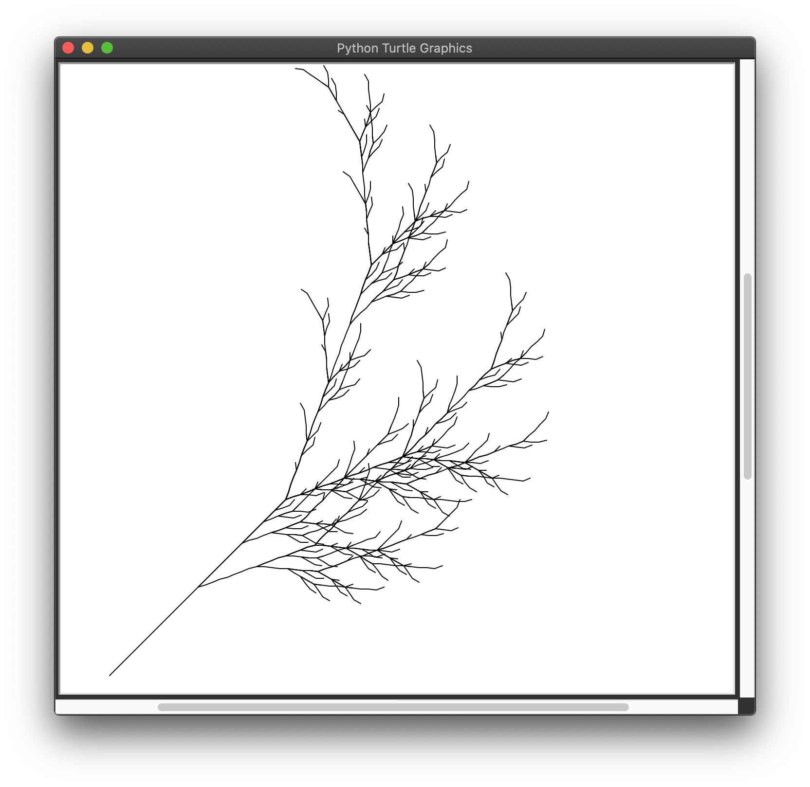

# Projet : Une plante fractale

???+ warning "But"

    Le but de ce projet d'une durée de deux heures est d'obtenir le dessin d'une plante fractale comme celui ci-dessous.

    

    Pour cela, nous utiliserons le formalisme dit de Lindenmayer (dit [L-système](https://fr.wikipedia.org/wiki/L-Syst%C3%A8me){target = _blank}).

!!! warning "Important"

    Le travail est décomposé en plusieurs exercices corrigés. 
    
    Au fur et à mesure de votre avancée,
    
    - vérifier votre travail grâce au petit gendarme (à droite de la flèche de téléversement) ;
    - copier vos fonctions sur Thonny ;
    - faites la partie Turtle sur Thonny.

## Présentation du projet

Pour créer des fractales avec un système de Lindenmayer, on part d'un tableau contenant un ensemble de lettre. appelée axiome. Pour une plante fractale, l'axiome est "X".

À partir de cet axiome et en appliquant de **règles de transformation**, on construit un tableau de lettres de plus en plus grand.

Pour une plante fractale, les règles sont :

 - "X" devient "F+[[X]-X]-F[-FX]+X"
 - "F" devient "FF"
 - n'importe quelle autre caractère est inchangée.

À titre d'exemple, si on prend pour axiome `#!python ['F', 'X', 'A']`, le code devient :

 - étape 1: `#!python ['F', 'X', 'A']`
 - étape 2: `#!python ['F', 'F', 'F', '+', '[', '[', 'X', ']', '-', 'X', ']', '-', 'F', '[', '-', 'F', 'X', ']', '+', 'X', 'A']`
 - étape 3: `#!python ['F', 'F', 'F', 'F', 'F', 'F', '+', '[', '[', 'F', '+', '[', '[', 'X', ']', '-', 'X', ']', '-', 'F', '[', '-', 'F', 'X', ']', '+', 'X', ']', '-', 'F', '+', '[', '[', 'X', ']', '-', 'X', ']', '-', 'F', '[', '-', 'F', 'X', ']', '+', 'X', ']', '-', 'F', 'F', '[', '-', 'F', 'F', 'F', '+', '[', '[', 'X', ']', '-', 'X', ']', '-', 'F', '[', '-', 'F', 'X', ']', '+', 'X', ']', '+', 'F', '+', '[', '[', 'X', ']', '-', 'X', ']', '-', 'F', '[', '-', 'F', 'X', ']', '+', 'X', 'A']`

Ce tableau va permettre de donner des instructions `#!python Turtle` permettant de dessiner la plante fractale.

Ainsi :

 - si on lit un "+", on tourne à droite de 25° ;
 - si on lit un "-", on tourne à gauche de 25° ;
 - si on lit un "F", on avance de 10 pixels ;
 - si on lit un "[", on enregistre dans un tableau la position et l'angle actuel de la tortue ;
 - si on lit un "]", on récupère à partir du tableau la position et l'angle de la tortue précédemment enregistré.

## Partie 1 : création du tableau

!!! {{exercice(True, 0)}}

    En vous aidant des commentaires, écrire la fonction `#!python ajouter_lettre` qui prend en paramètres :

    - un tableau de lettres `#!python T` de taille `#!python len(T)`;
    - une lettre `#!python lettre`.

    Cette fonction renvoie un tableau de lettres `#!python T` de taille `#!python len(T) + 1`. 

    Par exemple :

    ```bash
    ajouter_lettre(['X', 'X', 'X'], '+')
    ```
    renvoie
    ```bash
    ['X', 'X', 'X', '+']
    ```

    {{IDEv('projet2/exo1')}}

!!! {{exercice(True)}}

    Maintenant que nous pouvons ajouter une lettre à un tableau, nous devons créer une fonction permettant d'en ajouter plusieurs.

    Écrire une fonction s'appelant `#!python ajouter_expression` qui prend en paramètres :

    - un tableau de lettres `#!python T` de taille `#!python len(T)`;
    - une expression `#!python expression` composée de plusieurs lettres.

    Cette fonction parcourt et ajoute tous les caractères contenus au sein d'une expression dans un tableau. Elle renvoie un tableau de lettres `#!python T` de taille `#!python len(T) + len(expression)`. 

    Par exemple :

    ```bash
    ajouter_expression(['X', 'X', 'X'], '+XF')
    ```
    renvoie
    ```bash
    ['X', 'X', 'X', '+', 'X', 'F']
    ```

    {{IDE('projet2/exo2')}}

!!! {{exercice(True)}}

    Maintenant que nous savons ajouter une expression à un tableau, nous devons créer une fonction permettant de passer d'une étape à la suivante. Pour cela, il faut créer un nouveau tableau à partir du tableau existant. 
    
    On va par exemple :
    
    - à partir du tableau de l'étape 1, créer le tableau de l'étape 2 ;
    - à partir du tableau de l'étape 2, créer le tableau de l'étape 3.

    Écrire une fonction s'appelant `#!python générer_nouveau_tableau` qui prend en paramètre :

    - un tableau de lettres `#!python T` de taille `#!python len(T)`.

    Cette fonction renvoie le nouveau tableau de lettres. 

    La stratégie est la suivante :

    - cette fonction part d'un nouveau tableau `#!python nouveau_tableau` vide ;
    - elle parcourt un par un tous les éléments du tableau :

        - si l'élément est un `#!python 'X'`, on ajoute l'expression "F+[[X]-X]-F[-FX]+X" à `#!python nouveau_tableau` ;
        - si l'élément est un `#!python 'F'`, on ajoute l'expression "FF" à `#!python nouveau_tableau` ;
        - si l'élément est un autre caractère, on ajoute cette lettre à `#!python nouveau_tableau`.

    Par exemple :

    ```bash
    générer_nouveau_tableau(['X'])
    ```
    renvoie
    ```bash
    ['F', '+', '[', '[', 'X', ']', '-', 'X', ']', '-', 'F', '[', '-', 'F', 'X', ']', '+', 'X']
    ```

    {{IDE('projet2/exo3')}}

!!! {{exercice(True)}}

    Finalement, il faut générer la plante à un certain degré de finesse. 
    
    Cela signifie que l'on cherche, à partir de l'axiome à créer la plante de l'étape 4, 5 ou 6. La finesse correspond au numéro de l'étape.

    Écrire une fonction s'appelant `#!python générer_plante` qui prend en paramètre :

    - un tableau de lettres `#!python axiome` ;
    - un degré de finesse `#!python finesse`.

    Cette fonction renvoie la plante sous forme d'un tableau de lettres à un certain degré de finesse.

    Par exemple :

    ```bash
    générer_plante(['X'], 2)
    ```
    
    renvoie

    ```bash
    ['F', 'F', '+', '[', '[', 'F', '+', '[', '[', 'X', ']', '-', 'X', ']', '-', 'F', '[', '-', 'F', 'X', ']', '+', 'X', ']', '-', 'F', '+', '[', '[', 'X', ']', '-', 'X', ']', '-', 'F', '[', '-', 'F', 'X', ']', '+', 'X', ']', '-', 'F', 'F', '[', '-', 'F', 'F', 'F', '+', '[', '[', 'X', ']', '-', 'X', ']', '-', 'F', '[', '-', 'F', 'X', ']', '+', 'X', ']', '+', 'F', '+', '[', '[', 'X', ']', '-', 'X', ']', '-', 'F', '[', '-', 'F', 'X', ']', '+', 'X']
    ```

    {{IDE('projet2/exo4')}}


## Cours

!!! {{cours()}}

    En Python, il est possible de gérer les tableaux de manière dynamique, en ajoutant et en retirant des éléments au tableau courant.

    Les instructions pour réaliser ces opérations sont : 

    - `#!python tableau.append(élément)` ajoute un élément à la fin d'un tableau ;
    - `#!python tableau.pop(0)` retire le premier élément d'un tableau et renvoie sa valeur ;
    - `#!python tableau.pop(-1)` retire le dernier élément d'un tableau et renvoie sa valeur.

    !!! example "Exemple"

        Essayez-lez !

        {{IDEv('projet2/tableau_dynamique')}}

## Partie 2 : Turtle

Cette seconde partie se déroule uniquement sur Thonny.

!!! {{exercice(True)}}

    Nous allons maintenant dessiner la plante fractale !

    Pour se faire, nous devons intégrer les lettres présentes dans notre tableau.

    - [ ] Copier le code ci-dessous dans Thonny ;
    - [ ] Compléter la fonction `#!python dessiner_plante` qui prend pour paramètres :
        
        - un tableau de lettres `#!python tableau` générer grâce à la fonction `#!python générer_plante` ;
        - une longueur `#!python longueur` correspondant à la longueur d'un trait. 

        Pour compléter cette fonction, allez voir l'interprétation des lettres en Tortue sur le [lien wikipédia](https://fr.wikipedia.org/wiki/L-Système#Interprétation_en_tortue){target = _blank}. On prendra la distance unitaire égale à 10 et l'angle égal à 25°.

    {{IDE('projet2/exo5')}}

    ??? help "Aide"

        Pour obtenir :
         
        - la position actuelle de la tortue, on fait `#!python turtle.pos()` ;
        - la direction actuelle de la tortue, on fait `#!python turtle.heading()`.

        Pour donner :

        - une position à la tortue, on fait `#!python turtle.setpos(position_à_donner)` ;
        - une direction à la tortue, on fait `#!python turtle.seth(direction_à_donner)`.

        On pensera à lever le stylo avec `#!python turtle.penup()` avant de replacer la tortue à son ancien emplacement, puis à le baisser avec `#!python turtle.pendown()`.

    - [ ] Dessiner des plantes fractales et amusez-vous !
