```mermaid
%%{init:{'theme': 'dark' }}%%
flowchart TD
subgraph Ligne 3  . . . ..____________________ 
    direction LR
    p2[x]-.->|X|A3
    p2[x]-->A4
    q2[y]-->A4
    subgraph t2[Variables]
    style t2 fill:#29f,stroke:#333,stroke-width:2px
    direction LR
        p2[x]
        q2[y]
    end
    subgraph id2[Mémoire]
    style id2 fill:#29f,stroke:#333,stroke-width:2px
    subgraph pml2[Adresses]
        direction RL
        A3[ #89]
        A4[ #719]
    end

    subgraph iop2[Valeur]
        B3[1]
        B4[1.0]
    end
    A3---B3
    A4---B4
    end
    end

subgraph Ligne 2 . .. . . . . . ..________________ 
    direction LR
    p1[x]-->A1
    q1[y]-->A2
    subgraph t1[Variables]
    style t1 fill:#29f,stroke:#333,stroke-width:2px
    direction LR
        p1[x]
        q1[y]
    end
    subgraph id1[Mémoire]
    style id1 fill:#29f,stroke:#333,stroke-width:2px
    subgraph pml1[Adresses]
        direction RL
        A1[ #89]
        A2[ #719]
    end

    subgraph iop1[Valeur]
        B1[1]
        B2[1.0]
    end
    A1---B1
    A2---B2
    end
    end

subgraph Ligne 1 . .. . . . . . ...____________ 
    direction LR
    p[x]-->A
    subgraph t[Variables]
    style t fill:#29f,stroke:#333,stroke-width:2px
    direction LR
        p[x]
    end
    subgraph id[Mémoire]
    style id fill:#29f,stroke:#333,stroke-width:2px
    subgraph pml[Adresses]
        direction RL
        A[ #89]
    end

    subgraph iop[Valeur]
        B[1]
    end
    A---B
    end
    end
```

# Variables

## Terminal, console et éditeur de code

Un terminal est une invite de commandes permettant à l'homme et à la machine de communiquer de manière interactive.

Pour programmer, il existe deux grands types d'outils :

- la console (aussi appelé interpréteur) permet de réaliser des calculs, des tests rapides ainsi que des programmes courts. On ne sauvegarde pas son travail ;
- l'éditeur de code permet d'écrire un programme complexe dans un langage donné et de sauvegarder son travail. Il est souvent combiné à un interpréteur afin d'exécuter le programme et de le rendre compréhensible par l'ordinateur.

!!! example "Exemple"

    === "Une console"

        - [ ] Calculez la somme de 134 et de 5677 dans la console. Pour valider, appuyez sur ++enter++. 
        - [ ] Faites également leur multiplication à l'aide de l'opérateur `*`.

        {{terminal()}}

    === "Un éditeur de code"

        Lancez le script à l'aide de la flèche.

        {{IDEv('python1/ex1')}}
    

Au fur et à mesure de votre apprentissage, vous utiliserez des éditeurs de code de plus en plus perfectionnés :

1. ce site web ;
2. Thonny ;
3. VSCodium.

## Hello World !

!!! tip "Premiers pas"

    Si votre console contient trop d'éléments, tapez `#!bash clear` pour tout effacer. L'historique sera conservé.

    === {{exercice(False, 0)}}

        Créons tout de suite notre premier programme[^id]. 
        
        Dans la console ci-dessous, tapez : `#!python print("Hello world !")` et appuyez sur ++enter++.  Que se passe-t-il ?

        [^id]: la tradition d’utiliser hello world comme premier programme de test a été initiée par le livre `The C Programming Language` de Brian Kernighan et Dennis Ritchie, publié en 1978.

    === {{exercice(False)}}

        Dans la console, affichez la phrase "Bonjour le monde !". 

        ??? help "Aide" 
        
            Avez-vous bien utilisé des guillemets comme dans l'exercice précédent ?

    === {{exercice(False)}}

        Dans la console ci-dessous, réalisez la soustraction de 956 et de 649.

        Utilisez l'instruction `#!python print` pour afficher à nouveau le résultat de cette opération.

        ??? help "Aide" 
        
            On ne peut pas soustraire un affichage avec `#!python print`.
            
            Pas de guillemets ici. Voyez-vous quelle est la différence fondamentale entre la soustraction et les phrases des exercices 1 et 2 ?

    {{terminal()}}

!!! warning "Important"

    Vous obtenez le même affichage que vous fassiez `#!python 45*4` ou `#!python print(45*4)`. 

    On aurait pu aussi taper `#!console >>> "Hello World !"` sans `#!python print`. Cela fonctionne car la console **évalue** des expressions Python **puis affiche** le résultat de l'évaluation. 
    
    `#!python print` sera principalement utilisée pour **^^afficher^^ la valeur référencée par une variable** dans des programmes complexes.

## Notion de variable

Nous évoquons ci-dessous la notion de variable. Celle-ci sera revue en cours en activité débranchée.

!!! {{cours()}}

    Une variable **représente** une zone de stockage dans la mémoire de l'ordinateur. Elle permet donc à l'humain d'accéder à des valeurs numériques, du texte ou des tableaux de nombres stockés dans l'ordinateur à une adresse précise. 
    
    Une variable contient une **référence** (une sorte d'adresse) vers un objet contenant une valeur. Un humain accède à ces valeurs grâce à un **nom de variable**.

    L'instruction `#!python x = 2` permet de _relier_ un nom de variable `#!python x` avec une valeur `#!python 2`. Le nom de variable `#!python x` contient donc l'adresse de la valeur entière `#!python 2`. Ce lien `#!python =` ne fonctionne que dans un sens : de la droite vers la gauche ou ← .

    ```python
    annee = 2010      # Ligne 1
    envol = annee     # Ligne 2
    annee = annee + 1 # Ligne 3
    # Ligne 1 : la variable nommée "annee", est associée à une valeur (ici 2010)    
    # Ligne 2 : la variable nommée "envol" contient la même adresse que la variable nommée "annee". 
    #           Elle référence donc la même valeur (ici 2010).
    # Ligne 3 : On ajoute 1 à la valeur précédemment référencée par la variable nommée "annee".
    #           Une nouvelle zone mémoire est réservée. "annee" contient une nouvelle adresse, 
    #           associée à la valeur 2011.
    ```

    ```mermaid 
    %%{init:{'theme': 'dark' }}%%
    flowchart TD

    subgraph Après la ligne 3 . . . . _ ______________
    direction LR
    p[envol]-->A21
    q[annee]-.->|X|A21
    q[annee]-->A41
    subgraph t[Variables]
    style t fill:#29f,stroke:#333,stroke-width:2px
    direction LR
        q[annee]
        p[envol]
    end
    subgraph id2[Mémoire]
    style id2 fill:#29f,stroke:#333,stroke-width:2px
    subgraph pml[Adresses]
        direction RL
        A21[ #56]
        A41[ #691]
        A51[ ...]
    end

    subgraph iop[Valeurs]
        B111[2010]
        B11[2011]
    end
    A21---B111
    A41---B11
    end
    end

    subgraph Avant . . . . . _ ______________
    direction LR
    envol-->A2
    annee-->A2
    subgraph Variables
    style Variables fill:#29f,stroke:#333,stroke-width:2px
    direction LR
        annee
        envol
    end
    subgraph id[Mémoire]
    style id fill:#29f,stroke:#333,stroke-width:2px
    subgraph Adresses
        direction RL
        A2[#56]
        A3[...]
        A4[#691]
        A5[...]
    end

    subgraph Valeur
        B[2010]
    end
    A2---B
    end
    end
    ```

!!! warning "Vocabulaire"

    === "Déclaration"
        Une déclaration indique l'existence d'une entité informatique possédant certaines caractéristiques.

        !!! example "Exemple"

            En Fortran 90, on déclare des variables `#!fortran pi` et `#!fortran entier` ainsi :
            ```fortran
            real    :: pi
            integer :: entier
            ```

        ??? danger "Pour aller plus loin"

            Dans de nombreux langages de programmation, la déclaration permet de définir le nombre d'octets à réserver en mémoire, sa représentation interne, l'ensemble des valeurs admissibles et l'ensemble des opérateurs qui peuvent lui être appliqués.
        
    
    === "Initialisation"
        Une initialisation est l'association **initiale** d'un contenu (une valeur) avec une variable déclarée préalablement.

        !!! example "Exemple"

            On initialise les variables `#!fortran pi` et `#!fortran entier` :
            ```fortran
            pi = 3.141592
            entier = 42
            ```            

    === "Affectation"
        Une affectation est l'association d'un contenu (une valeur) avec une variable **déjà initialisée**. 

        !!! example "Exemple"

            On affecte de nouvelles valeurs aux variables `#!fortran pi` et `#!fortran entier` :
            ```fortran
            pi = 6.283184
            entier = 42 * 8
            ```
        
    === "Incrémentation"
        Une incrémentation est l'augmentation régulière de la valeur associée à une variable.

        !!! example "Exemple"
            ```python
            pi = pi + 2   # la variable pi est reliée à l'ancienne valeur de pi augmentée de 2.
            ```

        ??? danger "Pour aller plus loin"
            Ce symbole `=` n'a rien à voir avec le égal mathématique. `#!python a = a + 2` a un sens en Python mais est une proposition logique fausse en Maths.

!!! {{cours()}}
    En Python, la déclaration et l'initialisation se font en même temps. On appelle cela le **typage dynamique**.

    Lorsque Python voit `#!python x = 2` : il _comprend_ qu'un entier _arrive_ et réserve l'espace en mémoire pour stocker cet entier (déclaration); il comprend que la variable nommée `#!python x` référence la valeur 2 (initialisation).

    ??? danger "Pour aller plus loin"
        En Python, le typage dynamique permet la modification du type référencé par la variable `x`. Par exemple, `#!python x = 'Bonjour'` permet de référencer le mot `#!python 'Bonjour'` plutôt que l'entier `#!python 2`.

        En Python, ces changements de types (passage d'un mot à un entier) se font via le _duck typing_. 

        Pour faire simple, le _duck typing_ permet de faire cela :

        


!!! tip "Créer des variables"

    === {{exercice(False)}}

        - [ ] Dans la console ci-dessous, créez une variable entière nommée `m` représentant la valeur 7. 
        - [ ] Affichez ensuite la valeur référencée par cette variable.

    === {{exercice(False)}}

        - [ ] Dans la console ci-dessous, créez une variable réelle nommée `vitesse_initiale` représentant la valeur 12.7 . 
        - [ ] Affichez ensuite la valeur référencée par cette variable .

    === {{exercice(False)}}

        - [ ]  Dans la console ci-dessous, créez une variable de type mot nommée `3l3ment` représentant la valeur "Débuter en Python" . 
        - [ ]  Affichez ensuite cette variable dans la console.

        ??? help "Aide"

            Une erreur apparait. Il est interdit de commencer des noms de variables avec des chiffres. Renommez-là !

    === {{exercice(False)}}

        - [ ] Dans la console ci-dessous, créez deux variables entières nommées p et q représentant les valeurs 77 et 5. 
        
        - [ ] Affichez d'abord p, puis q dans la console.
        
        - [ ] Comment feriez-vous pour afficher p et q simultanément ?

        !!! help "Astuce"

            En Python, on peut déclarer et initialiser deux variables (ou plus) simultanément. Pour créer `a` et `b`, on ferait : `#!python a, b = 4, 5` .

    === {{exercice(False)}}

        - [ ] Dans la console ci-dessous, créez trois variables nommées `nb_passager`, `vitesse_moyenne_avion` et `nom_compagnie` représentant les valeurs 237, 977.3, "Air France". 
        - [ ] Affichez simultanément les trois valeurs dans la console ci-dessous.
  
    {{terminal()}}

## Nommage

Dans les exercices précédents, vous avez du remarquer que les variables :

- ne peuvent pas porter n'importe quel nom ;
- pointent vers différents types de données.

!!! {{cours()}}

    En Python, le nom d'une variable doit être choisi parmi les lettres de l'alphabet (minuscule et majuscule étant considérées comme différentes), les chiffres et le symbole `_`. 

    Les espaces ne sont pas autorisées : on utilisera donc le tiret bas `_` (appelé aussi _underscore_) pour les variables dont le nom est long.

    Le nom d'une variable doit être choisi de façon à être facilement compréhensible par un humain (ni trop court, ni trop détaillé).

    {{IDE('python1/nom_var')}}

    ??? danger "Pour aller plus loin"

        Cette convention de nommage s'appelle le _snake case_ et est préconisée pour Python. 
        
        On écrira donc `#!python nombre_opérations_par_seconde` plutôt que `#!python NombreOpérationParSeconde`.


!!! tip "Vrai/Faux sur le nommage des variables "

    Cocher les identifiants valides.

    === "Question"
        - [ ] `pas`
        - [ ] `Roi`
        - [ ] `2ame`
        - [ ] `v413t`
        - [ ] `dix`
        - [ ] `n'œuf`
        - [ ] `huit`
        - [ ] `Sète`
        - [ ] `carte_six`
        - [ ] `_5`
        - [ ] `%4`
        - [ ] `quatre-moins-un`
        - [ ] `2!`
        - [ ] `_`

    === "Solution"
        - [x] `pas`
        - [x] `Roi` ; non conforme au _snake case_ mais valide.
        - [ ] `2ame` ; interdit de commencer par un chiffre.
        - [x] `v413t`
        - [x] `dix`
        - [ ] `n'œuf` ; interdit d'utiliser `'`
        - [x] `huit`
        - [x] `Sète` ; non conforme au _snake case_ mais valide.
        - [x] `carte_six` ; très bon choix !
        - [x] `_5` ; très mal choisi mais valide.
        - [ ] `%4` ; interdit d'utiliser `%`
        - [ ] `quatre-moins-un` ; interdit d'utiliser `-`
        - [ ] `2!` ; interdit d'utiliser `!`
        - [x] `_`

!!! tip "Choisir des noms de variables"

    === {{exercice(False)}}

        - [ ] Dans la console ci-dessous, créez une variable entière représentant le nombre de briques de lait stockées dans un entrepot. On l'initialisera à `#!python 10000` briques.
        - [ ] Créez à présent une variable réelle représentant le volume total de toutes ces briques de lait. Pour l'initialiser, on considérera qu'une brique contient `#!python 0.75` L de lait.

        ??? help "Solution"

            - [x] `#!python nb_briques_lait` est le meilleur nom. `#!python nombre_briques`, `#!python nb_briques`, ou `#!python n_briques_lait` sont des noms corrects. 
            - [ ] `#!python nombrebriques`, `#!python nBriquesLait` ou `#!python nombre_de_briques_de_lait_dans_entrepot` ne respectent pas le _snake case_ ou sont trop longs.
            - [x] `#!python volume_total_lait` est le meilleur nom. `#!python volume_total_briques` ou `#!python vol_tot_briques` sont corrects.

    === {{exercice(False)}}

        - [ ] Dans la console ci-dessous, créez deux variables entières représentant les coordonnées d'un point A du plan. On initialisera ces variables à `#!python -4` et `#!python 2`.
        - [ ] Créez à présent deux variables représentant les coordonnées d'un vecteur $\vec{u}$ du plan. On initialisera ces variables à `#!python 2` et `#!python -1`.

        ??? help "Solution"

            - [x] `#!python x` et `#!python y` sont appropriés s'il n'y a qu'un seul point. `#!python x_A` et `#!python y_A` sont également convenables.
            - [x] `#!python vec_x` et `#!python vec_y` sont appropriés s'il n'y a qu'un seul vecteur. `#!python vec_u_x` et `#!python vec_u_y` sont également convenables. Par contre, `#!python vecX`, `#!python VEC_Y` ou `#!python abscisse_vecteur_u` sont à éviter.

    === {{exercice(False)}}

        Dans la console ci-dessous, créez une variable de type tableau représentant l'ensemble des températures du lac Léman relevées sur 4 jours. On initialisera notre variable grâce au tableau Python `#!python [17.7, 18.1, 18.2, 18.8]`.

        ??? help "Solution"

            `#!python temp_lac` ou `#!python temp_lac_léman` sont appropriés. `#!python temp` pourrait être correct mais est trop vague et `#!python température_lac_léman_4jours` est trop long. 

    {{terminal()}}

## Types de variables

Depuis le début du cours, vous avez du remarquer que les variables que l'on manipule ne représentent pas toujours le même objet (des entiers, des mots, des nombres à virgules).

Dans un langage de programmation, les objets référencés par les variables sont **typées** : ce sont des entiers, des _réels_, des tableaux etc. Ce type est défini au moment de la déclaration.

!!! {{cours()}}

    Les types principaux en Python sont :

    - les entiers (relatifs) : type `#!python int` ;
    - les flottants (approximation des nombres réels par des décimaux) : type `#!python float`;
    - les chaines de caractères (mots ou texte) : type `#!python str` ;
    - les booléens (`#!python True` ou `#!python False`) : type `#!python bool`.  
    Les booléens sont des variables n'ayant que deux valeurs possibles : Vrai ou Faux.

    ??? danger "Pour aller plus loin"
    
        Nous aurons rapidement besoin d'autres types permettant de décrire des ensembles de données :

        - les n-uplets : type `#!python tuple`;
        - les tableaux : type `#!python list`;
        - les dictionnaires : type `#!python dict`.

!!! {{exercice()}}

    En vous aidant des exercices précédents, déterminez les types des variables ci-dessous : 

    === "Question" 

        | Types | int | float | str | bool |
        |:---------|:-------|:-------|:-----|:------|
        | `#!python p = 8` | {{tit('')}} | {{tit('')}} | {{tit('')}} | {{tit('')}} |
        | `#!python nom = "Von Neumann"` | {{tit('')}} | {{tit('')}} | {{tit('')}} | {{tit('')}} |
        | `#!python e = 2.7172` | {{tit('')}} | {{tit('')}} | {{tit('')}} | {{tit('')}} |
        | `#!python p = 8.0` | {{tit('')}} | {{tit('')}} | {{tit('')}} | {{tit('')}} |
        | `#!python huit = "8"` | {{tit('')}} | {{tit('')}} | {{tit('')}} | {{tit('')}} |
        | `#!python r = 0` | {{tit('')}} | {{tit('')}} | {{tit('')}} | {{tit('')}} |
        | `#!python r = -120000` | {{tit('')}} | {{tit('')}} | {{tit('')}} | {{tit('')}} |
        | `#!python arrivé = True` | {{tit('')}} | {{tit('')}} | {{tit('')}} | {{tit('')}} |
        | `#!python huit = "8.0"` | {{tit('')}} | {{tit('')}} | {{tit('')}} | {{tit('')}} |
        | `#!python mort = "False"` | {{tit('')}} | {{tit('')}} | {{tit('')}} | {{tit('')}} |

    === "Solution" 

        | Types | int | float | str | bool | explication |
        |:---------|:-------|:-------|:-----|:------|:------|
        | `#!python p = 8` | {{tit('x')}} | {{tit('')}} | {{tit('')}} | {{tit('')}} ||
        | `#!python nom = "Von Neumann"` | {{tit('')}} | {{tit('')}} | {{tit('x')}} | {{tit('')}} ||
        | `#!python e = 2.7172` | {{tit('')}} | {{tit('x')}} | {{tit('')}} | {{tit('')}} |Le séparateur décimal est un point.|
        | `#!python p = 8.0` | {{tit('')}} | {{tit('x')}} | {{tit('')}} | {{tit('')}} |Le séparateur décimal est un point.|
        | `#!python huit = "8"` | {{tit('')}} | {{tit('')}} | {{tit('x')}} | {{tit('')}} |Les guillemets indiquent un `#!python str`.|
        | `#!python r = 0` | {{tit('x')}} | {{tit('')}} | {{tit('')}} | {{tit('')}} |`#!python 0` est un entier.|
        | `#!python r = -120000` | {{tit('x')}} | {{tit('')}} | {{tit('')}} | {{tit('')}} |`r` est un entier négatif donc relatif.|
        | `#!python arrivé = True` | {{tit('')}} | {{tit('')}} | {{tit('')}} | {{tit('x')}} |`#!python True` et `#!python False` sont des mots réservés.|
        | `#!python huit = "8.0"` | {{tit('')}} | {{tit('')}} | {{tit('x')}} | {{tit('')}} |Les guillemets indiquent un `#!python str`.|
        | `#!python mort = "False"` | {{tit('')}} | {{tit('')}} | {{tit('x')}} | {{tit('')}} ||

    ??? {{ext()}} 
        Pour connaitre le type référencée par une variable, on utilise l'instruction `#!python type(......)`. Par exemple, `#!python type(6100)` renvoie `#!python <class 'int'>`.

        {{terminal()}}

!!! {{cours()}}

    - Les entiers `#!python int` se remarquent par l'absence de virgules. Pour les grands nombres, il est possible de séparer les différents chiffres avec un tiret bas : `#!python 123_456_789` correspond au nombre $123456789$.
    - Les flottants `#!python float` sont écrits avec un **point** en guise de virgule : `#!python 3.1415` est le nombre égal à $3,1415$.
    - Les chaines de caractères `#!python str` peuvent être écrites de trois manières :

        1. guillemets simples ou doubles : `#!python 'une chaine'` ou `#!python "de caractères"`
        2. guillemets doubles si présence d'un guillemet simple dans la chaine de caractères : `#!python "l'oiseau"`
        3. trois guillemets doubles si présence de guillemets simples et doubles dans la chaine de caractères : `#!python """L'oiseau dit : "tu ne m'auras pas"."""`

!!! tip "Manipuler des types simples"

    === {{exercice(False)}}

        - [ ] Dans le terminal ci-dessous, initialiser les variables `#!python a, b, c, d, e, f` à 100; -8; 9,99; 8 290 753 123; Vrai; "Bonjour".
        - [ ] Vérifier vos réponses en affichant la variable et son type dans le terminal.

        Exemple : 
        ```python 
        z = 99
        z, type(z)
        ```

    === {{exercice(False)}}

        Voici une discussion entre élèves :
  
            - Bonjour. Que fais-tu?
            - Salut, j'apprends Python. 
            - Pas facile ! Mais Guido a dit : "Ca va être tellement utile".
        
        Dans le terminal ci-dessous, initialiser les variables `#!python phrase_1, phrase_2, phrase_3` à ces trois phrases.

        ??? help "Aide"

            Relisez le cours sur les trois méthodes permettant d'initialiser des chaines de caractères.

    {{terminal()}}

On peut convertir un objet d'un certain type en un autre type. Par exemple, on peut convertir une valeur référencée par une variable[^idp]:

[^idp]: Ce changement de type est appelé transtypage ou _casting_.

- en entier en utilisant `#!python int(variable)` ;
- en flottant en utilisant `#!python float(variable)` ;
- en chaine de caractères en utilisant `#!python str(variable)`.

```python
x = 1         # Ligne 1
y = float(x)  # Ligne 2 : y référence maintenant un str
x = y         # Ligne 3 
```



!!! {{exercice()}}
    Sur une feuille de papier, dessiner les deux schémas correspondant aux deux étapes :
    ```python
    x = 3.1415
    x = str(x)
    ```

!!! info "À quoi ça sert ?"

    Le transtypage sera particulièrement important lorsque nous lirons des fichiers externes en mode texte. Toutes leurs données seront en effet considérées comme du texte que nous devrons convertir, au besoin, en données numériques.

## Opérations simples

### Opérations sur les types numériques

!!! {{cours()}}
    En Python, pour les types `#!python int` et `#!python float` :
    
    - les quatre opérations mathématiques de base sont obtenues avec `#!python +, -, *, /` ;
    - les puissances sont obtenues avec `#!python **`;
    - les priorités opératoires usuelles sont respectées, l'utilisation des parenthèses `#!python ()` est possible. **Les crochets ou accolades sont interdits !**

    Les flottants sont _plus généraux_ que les entiers. Ainsi, si on additionne un `#!python int` avec un `#!python float`, nous obtiendrons un `#!python float`. La division donne toujours un `#!python float`.

    {{IDEv('python1/op_num')}}

!!! tip "Opérations"

    === {{exercice(False)}}

        On pose $n = 2$. 
        
        - [ ] Multiplier $n$ par lui-même 5 fois.
        - [ ] Multiplier $n$ par lui-même 10 fois.
        - [ ] Multiplier $n$ par lui-même 67 fois.

        ??? help "Solution"
            ```python
            >>> n = 2
            >>> n*n*n*n*n  # n**5
            32
            >>> n**10
            1024
            >>> n**67
            147573952589676412928
            ```

    === {{exercice(False)}}

        - [ ] On pose $x = 12.5$. Réaliser le programme de calcul suivant :

        - multiplier $x$ par 4
        - ajouter 10 au résultat
        - diviser le résultat par 6
        
        - [ ] Faites ce calcul en une ligne en utilisant des parenthèses.

        ??? help "Solution"
            ```python
            >>> x = 12.5
            >>> 4 * x
            50
            >>> 50 + 10
            60
            >>> 60 / 6
            10.0
            ``` 
            En une ligne : `#!python (4 * x + 10) / 6`. 

    === {{exercice(False)}}

        - [ ] On pose $p = 3$. On va modifier la valeur référencée par la variable $p$. Réaliser le programme de calcul suivant :

        - $p \leftarrow p+3$ (la nouvelle valeur de $p$ est égale à l'ancienne valeur de $p$ augmentée de 3)
        - $p \leftarrow p \times 3$ (la nouvelle valeur de $p$ est égale à l'ancienne valeur de $p$ multipliée par 3) 
        - $p \leftarrow \dfrac{p}{1.5}$ (la nouvelle valeur de $p$ est égale à l'ancienne valeur de $p$ divisée par 1.5)

        - [ ] Faites ce calcul en une ligne grâce aux parenthèses.

        ??? help "Solution"
            Vous devez trouver `#!python 12.0`.

    === {{exercice(False)}}
        Dans la variable `#!python durée_heure`, on donne une durée en heure. Par exemple, `#!python durée_heure = 2900`.

        Écrire les opérations permettant de convertir cette durée en jour et en semaine. On stockera ces durées dans les variables **flottantes** `#!python durée_jour` et `#!python durée_semaine`.

        ??? help "Solution"
            Vous devez trouver `#!python durée_jour = durée_heure / 24` et `#!python durée_semaine = durée_heure / 24 / 7`.

    === {{exercice(False)}}

        On choisit deux nombres entiers $a = 88$ et $b=12$. 
        
        On va calculer le quotient $q$ et le reste $r$ de la division euclidienne de $a$ par $b$. 
        
        On rappelle que le quotient est la partie entière (avant la virgule) de $\dfrac{a}{b}$ et que $a = b\times q+r$. 
        
        !!! example "Exemple" 
            $8/3 \approx 2.66666$ donc le quotient de la division euclidienne de $8$ par $3$ vaut 2.

        - Calculez $q \leftarrow \dfrac{a}{b}$
        - Convertissez $q$ en entier avec `#!python int(...)`.
        - À partir de $a, b, q$, calculez la valeur de $r$.

        ??? help "Aide"
            En deux étapes, on fait :
            ```python
            q = a / b
            q = int(q)
            ```
            ou en une étape : `#!python q = int(a/b)`.

        ??? help "Solution"
            `#!python q = 7` et `#!python r = 4`.

    === {{exercice(False)}}

        On reprend l'exercice précédent mais on souhaite calculer le quotient $q$ et le reste $r$ en une seule ligne ! 

        ??? help "Aide"    
            Pour initialiser plusieurs variables sur une ligne, on utilise `#!python var1, var2, var3, ... = 1, 'avion', 3.5, ...`.

        ??? help "Solution"
            `#!python q, r = int(a/b), a - b*int(a/b)`.

    {{terminal()}}

En informatique, on calcule régulièrement des quotients et des restes. Plutôt que d'utiliser les formules complexes trouvées à l'exercice précédent, on utilise :

- `#!python a // b` pour calculer le quotient d'une division euclidienne ;
- `#!python a % b` pour calculer le reste d'une division euclidienne.

!!! {{exercice()}}

    === "Question"

        Calculez le quotient et le reste de la division euclidienne de :
        
        - `#!python 9` et `#!python 2` ; 
        - `#!python 81` et `#!python 3` ;
        - `#!python 102` et `#!python 10` ; 
        - `#!python 21.7` et `#!python 7` ; 
        - `#!python 21.7` et `#!python 7.3`.

    === "Solution"

        Calculez le quotient et le reste de la division euclidienne de :
        
        - `#!python q, r = 9 // 2, 9 % 2` donne : `#!python q, r = 4, 1`; 
        - `#!python q, r = 81 // 3, 81 % 3` donne : `#!python q, r = 27, 0` ;
        - `#!python q, r = 102 // 10, 102 % 10` donne : `#!python q, r = 10, 2`; 
        - `#!python q, r = 21.7 // 7, 21.7 % 7` donne : `#!python q, r = 3.0, 0.6999999999999993` (Bizarre ce reste...); 
        - `#!python q, r = 21.7 // 7.3, 21.7 % 7.3` donne : `#!python q, r = 2.0, 7.1`. `//` et `%` fonctionnent entre flottants.

    {{terminal()}}

### Opérations sur les chaines de caractères (mots)

Dans un langage humain, le processus d'écriture consiste en l'**ajout** de mots les uns à la suite des autres.

On peut se répéter en **multipliant** nos propos.

!!! {{cours()}}

    En Python, pour le type `#!python str` :
        
    - l'addition de mots s'obtient avec `#!python +` ;
    - la répétition de mots s'obtient avec `#!python *` ;

    {{IDEv('python1/op_str')}}

!!! tip inline end "Paroles"
    ```
    She's crazy like a fool
    What about it Daddy Cool
    I'm crazy like a fool
    What about it Daddy Cool

    Daddy, Daddy Cool
    Daddy, Daddy Cool
    Daddy, Daddy Cool
    Daddy, Daddy Cool
    
    She's crazy like a fool
    What about it Daddy Cool
    I'm crazy like a fool
    What about it Daddy Cool

    Daddy, Daddy Cool
    Daddy, Daddy Cool
    Daddy, Daddy Cool
    Daddy, Daddy Cool
    ```

!!! {{exercice()}}

    === "Question"
        En utilisant le moins de lignes possibles, reproduisez les paroles de cette célèbre chanson.

        {{IDE('python1/chanson_str')}}

    === "Solution"

        Une solution possible : 

        {{IDE('python1/corr_chanson_str')}}

### Opérations interdites

Certaines opérations sont interdites. L'interpréteur Python va alors vous avertir avec un message d'erreur : il faut apprendre à lire ces messages qui souvent vous expliquent ce qui ne fonctionne pas.

!!! example "Exemples"

    === "Exemple 1"
        ```python
        >>> 4 + '4'
        Traceback (most recent call last):
        File "<console>", line 1, in <module>
        TypeError: unsupported operand type(s) for +: 'int' and 'str'
        ```
        Python nous avertit que l'opérateur `#!python +` ne peut être appliqué entre deux opérandes de type `#!python int` et de type `#!python str`, ce qui est logique : on n'ajoute que des nombres entre eux ou que des mots entre eux. Pas de mélange !

    === "Exemple 2"
        ```python
        >>> 'Coucou' * 1.2
        Traceback (most recent call last):
        File "<console>", line 1, in <module>
        TypeError: cannot multiply sequence by non-int of type 'float'
        ```
        Python nous avertit qu'un `#!python str` ne peut pas être multiplié par un `#!python float` (un non-`#!python int`.), ce qui est logique : la multiplication est la répétition de mots.

!!! {{exercice()}}

    Expliquez l'erreur que vous obtenez quand vous tapez :

    - `#!python "4" - 2` ;
    - `#!python "Allo ?"**10` ;
    - `#!python "8"*10 / 2`.  
  
    {{terminal()}}

!!! {{exercice()}}

    === "Question"

        Essayez de prédire le résultat de chacune des instructions suivantes, puis vérifiez-le dans la console :

        | Expression | Résultat 1 | Résultat 2 | Résultat 3 | Résultat 4 |
        |:---------|:-------|:-------|:-----|------|
        | `#!python (1 + 3) * 4` | {{tit('', '```#!python 16```')}} | {{tit('', '```#!python 16.0```')}} | {{tit('','```#!python 13```')}} | {{tit('', '```#!python unsupported operand type(s)``` <br> ```#!python for +: \'int\' and \'int\'```')}}  |
        | `#!python 5 / 2` | {{tit('', '```#!python 2```')}} | {{tit('', '```#!python 2.5```')}} | {{tit('','```#!python 1```')}} | {{tit('', '```#!python 2.0```')}}  |        
        | `#!python "Six" + 3` | {{tit('', '```#!python "Six3"```')}} | {{tit('', '```#!python 63```')}} | {{tit('','```#!python 9```')}} | {{tit('', '```#!python unsupported operand type(s)``` <br> ```#!python for +: \'str\' and \'int\'```')}}  |
        | `#!python 'adf' + 'bce'` | {{tit('', '```#!python "abcdef"```')}} | {{tit('', '```#!python \'adfbce\'```')}} | {{tit('','```#!python "adfbce"```')}} | {{tit('', '```#!python unsupported operand type(s)``` <br> ```#!python for +: \'str\' and \'str\'```')}}  |
        | `#!python ("La" + "Li") * 3` | {{tit('', '```#!python "LaLiLiLi"```')}} | {{tit('', '```#!python "LaLiLaLiLaLi"```')}} | {{tit('','```#!python "LaLi"*3```')}} | {{tit('', '```#!python cannot multiply sequence by``` <br> ```#!python non-int of type \'float\'```')}}  |        
        | `#!python 70 / 7 + 1` | {{tit('', '```#!python 11.0```')}} | {{tit('', '```#!python 11```')}} | {{tit('','```#!python 8.75```')}} | {{tit('', '```#!python 10 + 1```')}}  |        
        | `#!python "(1 + 3)" * 2` | {{tit('', '```#!python "44"```')}} | {{tit('', '```#!python 8```')}} | {{tit('','```#!python "(1+3)(1+3)"```')}} | {{tit('', '```#!python unsupported operand type(s)``` <br> ```#!python for *: \'str\' and \'int\'```')}}  |
        | `#!python "Ba" * 4 / 2` | {{tit('', '```#!python "BaBa"```')}} | {{tit('', '```#!python "Ba2"```')}} | {{tit('','```#!python "BaBaBa"```')}} | {{tit('', '```#!python unsupported operand type(s)``` <br> ```#!python for /: \'str\' and \'int\'```')}}  |
        | `#!python "Ba" * (4 / 2)` | {{tit('', '```#!python "BaBa"```')}} | {{tit('', '```#!python BaBa```')}} | {{tit('','```#!python "BaBaBaBa"```')}} | {{tit('', '```#!python cannott multiply sequence by``` <br> ```#!python non-int of type \'float\'```')}}  |
        | `#!python 89 % 2` | {{tit('', '```#!python 1```')}} | {{tit('', '```#!python True```')}} | {{tit('','```#!python 44```')}} | {{tit('', '```#!python 1.0```')}}  |

    === "Solution"

        Utilisez le cours et la console pour comprendre la correction ci-dessous.

        | Expression | Résultat 1 | Résultat 2 | Résultat 3 | Résultat 4 |
        |:---------|:-------|:-------|:-----|------|
        | `#!python (1 + 3) * 4` | {{tit('x', '```#!python 16```')}} | {{tit('', '```#!python 16.0```')}} | {{tit('','```#!python 13```')}} | {{tit('', '```#!python unsupported operand type(s)``` <br> ```#!python for +: \'int\' and \'int\'```')}}  |
        | `#!python 5 / 2` | {{tit('', '```#!python 2```')}} | {{tit('x', '```#!python 2.5```')}} | {{tit('','```#!python 1```')}} | {{tit('', '```#!python 2.0```')}}  |        
        | `#!python "Six" + 3` | {{tit('', '```#!python "Six3"```')}} | {{tit('', '```#!python 63```')}} | {{tit('','```#!python 9```')}} | {{tit('x', '```#!python unsupported operand type(s)``` <br> ```#!python for +: \'str\' and \'int\'```')}}  |
        | `#!python 'adf' + 'bce'` | {{tit('', '```#!python "abcdef"```')}} | {{tit('x', '```#!python \'adfbce\'```')}} | {{tit('x','```#!python "adfbce"```')}} | {{tit('', '```#!python unsupported operand type(s)``` <br> ```#!python for +: \'str\' and \'str\'```')}}  |
        | `#!python ("La" + "Li") * 3` | {{tit('', '```#!python "LaLiLiLi"```')}} | {{tit('x', '```#!python "LaLiLaLiLaLi"```')}} | {{tit('x','```#!python "LaLi"*3```')}} | {{tit('', '```#!python cannot multiply sequence by``` <br> ```#!python non-int of type \'float\'```')}}  |        
        | `#!python 70 / 7 + 1` | {{tit('x', '```#!python 11.0```')}} | {{tit('', '```#!python 11```')}} | {{tit('','```#!python 8.75```')}} | {{tit('', '```#!python 10 + 1```')}}  |        
        | `#!python "(1 + 3)" * 2` | {{tit('', '```#!python "44"```')}} | {{tit('', '```#!python 8```')}} | {{tit('x','```#!python "(1+3)(1+3)"```')}} | {{tit('', '```#!python unsupported operand type(s)``` <br> ```#!python for *: \'str\' and \'int\'```')}}  |
        | `#!python "Ba" * 4 / 2` | {{tit('', '```#!python "BaBa"```')}} | {{tit('', '```#!python "Ba2"```')}} | {{tit('','```#!python "BaBaBa"```')}} | {{tit('x', '```#!python unsupported operand type(s)``` <br> ```#!python for /: \'str\' and \'int\'```')}}  |
        | `#!python "Ba" * (4 / 2)` | {{tit('', '```#!python "BaBa"```')}} | {{tit('', '```#!python BaBa```')}} | {{tit('','```#!python "BaBaBaBa"```')}} | {{tit('x', '```#!python cannot multiply sequence by``` <br> ```#!python non-int of type \'float\'```')}}  |
        | `#!python 89 % 2` | {{tit('x', '```#!python 1```')}} | {{tit('', '```#!python True```')}} | {{tit('','```#!python 44```')}} | {{tit('', '```#!python 1.0```')}}  |


    {{terminal()}}

## Résumé

!!! conclu "Résumé"

    Dans ce chapitre, j'ai appris : 
    
    - [ ] ce qu'est une variable (nom, valeur)
    - [ ] comment nommer une variable correctement (snake_case)
    - [ ] qu'une variable est _typée_ (`#!python int, float, bool, str`)
    - [ ] qu'on ne peut pas effectuer n'importe quelle opération sur n'importe quel type de variable
    - [ ] à comprendre _(un peu)_ les messages d'erreur