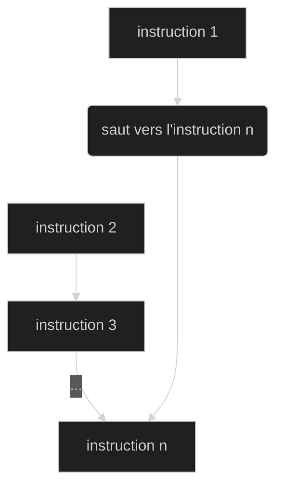

# Structures de contrôle : conditionnelles

## Principe

On peut imaginer qu'un programme est une suite finie de choix, permettant de s'adapter aux situations rencontrées. Ce type de choix s'appelle un branchement conditionnel[^a].

[^a]: Il existe également des branchements inconditionnels qui ont lieu sans qu'aucune condition soit vérifiée (voir schéma ci-dessous où on passe directement de l'instruction 1 à l'instruction n). Nous utiliserons de tels branchements lorsque nous travaillerons sur l'assembleur. Sachez toutefois que ces branchements sont à proscrire en programmation de haut niveau.



!!! {{cours()}}

    !!! tip inline end "_Graphe de contrôle_"
        ```mermaid
        %%{init:{'theme': 'dark' }}%%
        graph TD;
        A[début du programme]-->p("#60;condition à remplir#62;");
        p-->|Vrai|B;
        p-->|Faux|C;
        B-->D[suite du programme];
        C-->D[suite du programme];
        class p if;
        ```

    Une conditionnelle permet d'effectuer une action si une certaine condition est vérifiée.

    On peut représenter une telle situation dans un _graphe de contrôle_ (voir schéma ci-contre).

!!! tip "Comprendre les conditionnelles"
    Dans les exercices ci-dessous, sur une feuille, dessinez le _graphe de contrôle_ correspondant au programme proposé.

    === {{exercice(False, 0)}}
        Un site de vente en ligne propose la livraison gratuite au-delà de 90€ d'achats. 
        Voici le programme écrit en Français.
        ``` linenums="1"
        prix ← prix du panier
        si prix <= 90€ alors :
            frais_port ← 7€
        sinon :
            frais_port ← 0€
        prix_total ← prix + frais_port
        afficher prix_total
        ```

        Solution[^1] en fin de cours

        [^1]: Cliquez sur la flèche pour revenir au cours
            ```mermaid
            %%{init:{'theme': 'dark' }}%%
            graph TD;
            A["prix ← prix du panier"]-->p("prix <= 90€");
            p-->|Vrai|B["frais_port ← 7€"];
            p-->|Faux|C["frais_port ← 0€"];
            B-->D["prix_total ← prix + frais_port <br /> afficher prix_total"];
            C-->D;
            class p if;
            ```

    === {{exercice(False)}}
        On donne une autre proposition pour le programme de l'exercice 1. 
        Voici le programme écrit en Français.
        ``` linenums="1"
        frais_port ← 0€
        prix ← prix du panier
        si prix <= 90€ alors :
            frais_port ← 7€
        prix_total ← prix + frais_port
        afficher prix_total
        ```

        Solution[^2] en fin de cours

        [^2]: Cliquez sur la flèche pour revenir au cours. On passe directement à la suite du code si la condition est fausse.
            ```mermaid
            %%{init:{'theme': 'dark' }}%%
            graph TD;
            A["frais_port ← 0€ <br /> prix ← prix du panier"]-->p("prix <= 90€");
            p-->|Vrai|B["frais_port ← 7€"];
            p-->|Faux|D;
            B-->D["prix_total ← prix + frais_port <br /> afficher prix_total"];
            class p if;
            ```

    === {{exercice(False)}}
        Un thermostat permet de réguler la température d'un réfrigérateur à 5°C. 
        Voici le programme écrit en Anglais.
        ``` linenums="1"
        temperature ← measuring the inside temperature of the fridge
        if temperature > 5°C then :
            temperature ← temperature - 0.1°C
        else:
            temperature ← temperature + 0.1°C
        go back to the beginning of the program 
        ```

        Solution[^3] en fin de cours

        [^3]: Cliquez sur la flèche pour revenir au cours
            ```mermaid
            %%{init:{'theme': 'dark' }}%%
            graph TD;
            A["temperature ← measuring the inside temp..."]-->p("temperature > 5°C");
            p-->|Vrai|B["temperature ← temperature - 0.1°C"];
            p-->|Faux|C["temperature ← temperature + 0.1°C"];
            B-->D[go back];
            C-->D[go back];
            D-..->A;
            class p if;
            ```

    === {{exercice(False)}}
        Voici un programme écrit en Python. Remarquez que les instructions sont presque les mêmes qu'en Anglais.
        ```python linenums="1"
        age_client = 15
        if age_client <= 12 :
            prix = 5
        else:
            prix = 10
        print(prix)
        ```

        Solution[^4] en fin de cours

        [^4]: Cliquez sur la flèche pour revenir au cours
            ```mermaid
            %%{init:{'theme': 'dark' }}%%
            graph TD;
            A["age_client = 15"]-->p("age_client <= 12");
            p-->|Vrai|B["prix = 5"];
            p-->|Faux|C["prix = 10"];
            B-->D["print(prix)"];
            C-->D;
            class p if;
            ```

    === {{exercice(False)}}
        Voici un programme écrit en Python. Vous pouvez modifier la valeur de `#!python nombre` pour vous aider à comprendre le fonctionnement du programme.
        {{IDE('python2/exo5')}}

        Solution[^5] en fin de cours

        [^5]: Cliquez sur la flèche pour revenir au cours
            ```mermaid
            %%{init:{'theme': 'dark' }}%%
            graph TD;
            A["nombre = 48 <br /> diviseur = 1"]-->p1("nombre % 2 == 0");
            p1-->|Vrai|p2("nombre % 3 == 0");
            p2-->|Vrai|B["diviseur = 6"]-->p4["print(diviseur)"];
            p2-->|Faux|C["diviseur = 2"]-->p4;
            p1-->|Faux|p3("nombre % 3 == 0");
            p3-->|Vrai|D["diviseur = 3"]-->p4;
            p3--->|Faux|p4;
            class p1,p2,p3 if;
            ```

## Conditionnelle _if_/_else_

!!! {{cours()}}
    !!! tip inline end "_Graphe de contrôle_"
        ```mermaid
        %%{init:{'theme': 'dark' }}%%
        graph TD;
        A[début code]-->p("condition");
        p-->|Vrai|B[bloc code B];
        p-->|Faux|C[bloc code C];
        B-->D[suite code];
        C-->D;
        class p if;
        ```

    En Python, la syntaxe des instructions conditionnelles est la suivante :
    
    ```python
    début code
    if condition :
        bloc code B
    else:
        bloc code C
    suite code
    ```

    !!! warning "Trois détails importants"

        - comme en Anglais, le test conditionnel est réalisé avec `#!python if/else` ;
        - à la fin d'une ligne contenant `#!python if/else`, on ajoute deux-points `#!python :` ;
        - **tout** le bloc de code B (ou C) doit être indenté avec une tabulation ++tab++.

!!! tip "Choisissez la syntaxe correcte"

    === "Question"

        - [ ] Proposition 1
            ```python 
            if nombre_points == 20:
                niveau = niveau + 1
            ```
        - [ ] Proposition 2
            ```python 
            if nombre_points = 20:
                niveau = niveau + 1
            ```
        - [ ] Proposition 3
            ```python 
            if nombre_points == 20
                niveau = niveau + 1
            ```
        - [ ] Proposition 4
            ```python 
            if nombre_points == 20: 
            niveau = niveau + 1
            ```

    === "Réponse"

        - [x] Proposition 1 : correcte !
            ```python 
            if nombre_points == 20:
                niveau = niveau + 1
            ```
        - [ ] Proposition 2 : attention au double égal.
            ```python 
            if nombre_points = 20:
                niveau = niveau + 1
            ```
        - [ ] Proposition 3 : attention aux deux-points manquants.
            ```python 
            if nombre_points == 20
                niveau = niveau + 1
            ```
        - [ ] Proposition 4 : attention à la tabulation.
            ```python 
            if nombre_points == 20: 
            niveau = niveau + 1
            ```             

!!! tip "Écrire des conditionnelles"
    === {{exercice(False)}}

        Dans l'éditeur ci-dessous, écrire un programme qui, selon la valeur d'un nombre réel $n$ :

        - affiche "Strictement positif" si $n$ est strictement supérieur à 0 ;
        - affiche "Négatif ou nul" sinon. 

        On propose le début du programme avec la valeur de $n$ que l'on peut faire varier.
        ```python
        n = -12 # valeur donnée par l'utilisateur
        if n >= 0: # condition
            print( "Strictement positif" ) # affichage
        ```
    
        {{IDE('python2/exo8')}}


    === {{exercice(False)}}

        Dans l'éditeur ci-dessous, écrire un programme qui, selon la valeur d'un nombre réel $a$ :

        - affiche 'Pair' si $a$ est divisible par $2$ ;
        - affiche 'Impair' sinon. 

        On propose le début du programme avec la valeur de $a$ que l'on peut faire varier.
        ```python
        a = 100 # valeur donnée par l'utilisateur
        if ... :                            
            ...
        else:
            ...
        ```
        
        ??? help "Aide 1"

            On rappelle qu'un nombre $a$ est divisible par un nombre $b$ si le reste de la division euclidienne de $a$ par $b$ est égal à $0$.

        ??? help "Aide 2"

            En Python, le reste de la division euclidienne de $a$ par $b$ s'obtient avec `#!python a % b`. 
            
            On teste si un nombre $p$ est égal à 0 avec un double égal : `#!python p == 0`.
    
        {{IDE('python2/exo9')}}

    === {{exercice(False)}}

        L'envoi d'un colis d'un poids compris entre $1$ et $6,2$ kg coute $1,4$ € le kilo.

        - [ ] Dans l'éditeur ci-dessous, écrire un programme qui, selon la valeur d'un nombre réel positif `#!python poids_colis` :

          - affiche 'Trop lourd' si `#!python poids_colis` est strictement supérieur à $6,2$ kg ;
          - affiche 'Trop léger' si `#!python poids_colis` est inférieur ou égal à $1,0$ kg ;
          - calcule et affiche le prix d'envoi du colis sinon.

        - [ ] Tester votre programme en modifiant la valeur de `#!python poids_colis`.
        - [ ] Une fois terminé, télécharger votre programme à l'aide de l'icône ++arrow-down++.

        ??? help "Aide 1"
            Voir le graphe de contrôle[^gcf] en fin de cours. 
            
            [^gcf]: Appuyez sur la flèche pour revenir à l'exercice.
                ```mermaid
                %%{init:{'theme': 'dark' }}%%
                graph TD;
                A["prix_au_kg = 1,4 € <br> poids_colis = 4 kg"]-->p("poids_colis strictement supérieur à 6,2 kg");
                p-->|Vrai|B["affiche 'Trop lourd'"];
                p-->|Faux|p1("poids_colis inférieur ou égal à 1,0 kg");
                p1-->|Vrai|C["affiche 'Trop léger'"];
                p1-->|Faux|p2["calcule et affiche le prix d'envoi du colis."];
                class p,p1 if;
                ```

        ??? help "Aide 2"
            En langage naturel, le programme va s'écrire : 
            ```
            prix_au_kg = 1,4 
            poids_colis = 4
            si poids_colis > 6,2 alors :
                afficher("Trop lourd")
            sinon :
                si poids_colis < 1.0 alors :
                    afficher("Trop léger")
                sinon :
                    prix_envoi = prix_au_kilo * poids_colis
                    afficher(prix_envoi)
            ```

        {{IDE('python2/exo10')}}

    === {{exercice(False)}}

        Retournons à la poste : l'envoi d'un colis répond maintenant au tableau ci-dessous.

        |Gamme de poids (en kg) |Prix au kilo|
        |:---:|---|
        |$[0; 1]$|0,55€/kg|
        |$]1; 6,2]$|1,4€/kg|
        |$]6,2; +\infty[$ |2,2€/kg|
        

        - [ ] Dans l'éditeur ci-dessous, téléverser le programme de l'exercice précédent grâce à l'aide de l'icône ++arrow-up++ ;
        - [ ] Modifier votre programme afin qu'il calcule et affiche le prix d'envoi d'un colis, selon la valeur du nombre réel positif `#!python poids_colis` ;
        - [ ] Tester votre programme en modifiant la valeur de `#!python poids_colis`.

        ??? help "Aide 1"
            On rappelle le programme corrigé de l'exercice précédent. 

            ```python
            --8<--- "docs/scripts/python2/corr_exo10.py"
            ```
            
        ??? help "Aide 2"
            Le prix au kilo est maintenant variable : modifiez la valeur référencée par la variable `#!python prix_au_kilo` en fonction de `#!python poids_colis`.

        {{IDE('python2/exo11')}}


La clause sinon (`#!python else`) n'est pas obligatoire. Si elle n'est pas précisée, le _bloc code C_ n'est pas défini et on passe directement à la _suite du code_ (voir exercice 2).

Lorsque plusieurs conditions sont imbriquées les unes dans les autres, la syntaxe devient très lourde. Pour faciliter l'écriture et le maintien des programmes, de nombreux langages font appel à des mots-clés alternatifs. En Python, il s'agit de `#!python elif` qui permet de créer un nouveau branchement.

!!! {{cours()}}

    !!! hint inline end "_Graphe de contrôle_"
        ```mermaid
        %%{init:{'theme': 'dark' }}%%
        graph TD;
        A[début code]-->p1("condition_1");
        p1-->|Vrai|B_1[bloc code B_1];
        p1-->|Faux|p2("condition_2");
        p2-->|Vrai|B_2[bloc code B_2];
        p2-->|Faux|pn1[...];
        pn1-->|Vrai|pn("condition_n");
        pn-->|Vrai|B_n[bloc code B_n];
        pn-->|Faux|C[bloc code C];
        B_1-->D[suite code];
        B_2-->D;
        B_n-->D;
        C-->D;
        class p1,p2,pn if;
        ```

    Lorsque plusieurs conditions sont imbriquées, la syntaxe ci-dessous est utilisée :

    === "Syntaxe lisible"

        ```python
        début code
        if condition_1:
            bloc code B_1
        elif condition_2:
            bloc code B_2
        [...]
        elif condition_n:
            bloc code B_n
        else:
            bloc code C
        suite code
        ```

    === "Syntaxe illisible"

        ```python
        début code
        if condition_1:
            bloc code B_1
        else:
            if condition_2:
                bloc code B_2
            else:
                [...]
                    if condition_n:
                        bloc code B_n
                    else:
                        bloc code C
        suite code
        ```

    Si la `#!python condition_1` n'est pas vérifiée, alors on passe à la `#!python condition_2`,
    Si la `#!python condition_2` n'est pas vérifiée, alors on passe à la `#!python condition_3`, etc.
    
    Les conditions sont donc effectuées les unes après les autres et le `#!python else` final n'est effectué que si toutes les autres conditions ne sont pas vérifiées.

!!! tip "Les conditionnelles imbriquées"
    === {{exercice(False)}}
        On vous donne le programme de l'exercice 9. 
        
        En utilisant l'instruction `#!python elif`, modifier ce programme afin de le rendre plus lisible.

        {{IDE('python2/exo12')}}

    === {{exercice(False)}}
        Dans l'éditeur ci-dessous, écrire un programme qui, selon la valeur d'un nombre réel $n$ :

        - affiche "Strictement positif" si $n$ est strictement supérieur à 0 ;
        - affiche "Négatif" si $n$ est strictement inférieur à 0 ;
        - affiche "Nul" si $n$ est égal à 0. 

        ```python
        n = -12 # valeur donnée par l'utilisateur
        if ... : # condition
            print( ... ) # affichage
        ```

        {{IDE('python2/exo13')}}


    === {{exercice(False)}}
        On choisit une année `#!python annee`.

        Dans l'éditeur ci-dessous, écrire un programme qui, grâce à un affichage, indique à l'utilisateur si cette année est bissextile (366 jours sur l'année). On rappelle qu'une année est bissextile :

        - si elle est divisible par 400.
        - si elle n'est pas divisible par 100 ;
        - si elle est divisible par 4 ;

        Quelques exemples : 2000 est bissextile mais 1700 ne l'est pas. Par contre 1712 est bissextile.

        ??? help "Aide 1"
            On rappelle qu'un nombre $a$ est divisible par un nombre $b$ si le reste de la division euclidienne de $a$ par $b$ est égal à $0$.

        ??? help "Aide 2"
            En Python, le reste de la division euclidienne de $a$ par $b$ s'obtient avec `#!python a % b`.

        {{IDE('python2/exo14')}}

    === {{exercice(False)}}

        Voici deux programmes écrits en Python :

        <table style="border-color:transparent;background-color:transparent">
        <tr>
            <td><b style="font-size:1.2em">
            Programme 1
            </td>
            <td><b style="font-size:1.2em">
            Programme 2
            </td>
        </tr>
        <tr>
            <td><b style="font-size:1.2em">
            ```python
            if a >= 60:
                a = a - 60
            elif a >= 30:
                a = a - 30
            else:
                a = 0
            print("La valeur de a est", a)
            ```
            </td>
            <td><b style="font-size:1.2em">
            ```python
            if a >= 60:
                a = a - 60
            if a >= 30:
                a = a - 30
            else:
                a = 0
            print("La valeur de a est", a)
            ```
            </td>
        </tr>
        </table>
        
        !!! hint inline end "Tableau"
            || a = 130|a=45|a=15|
            |----|---|---|---|
            |Programme 1|---|---|---|
            |Programme 2|---|---|---|

        - [ ] Dessiner les graphes de contrôle de ces programmes.
        - [ ] En utilisant ces graphes, écrire dans le tableau ci-contre les résultats du programme 1 et du programme 2 si :
          - `#!python a = 130`; 
          - `#!python a = 45`;
          - `#!python a = 15`. 
        - [ ] Vérifiez votre réponse en écrivant les programmes dans l'éditeur ci-dessous :

        {{IDE('')}}

        ??? help "Solution"
            
            || a = 130|a=45|a=15|
            |----|:---:|:---:|:---:|
            |Programme 1|70|15|0|
            |Programme 2|40|15|0|

            Dans le programme 1, le test `#!python a >= 30` n'est réalisé que si `#!python a < 60`. Il est impossible de faire deux soustractions.

            Dans le programme 2, le graphe de contrôle montre clairement que le test `#!python a >= 30` est toujours réalisé. Ainsi, dans le cas où `#!python a >= 60`, on retranche 60 à `#!python a`. Si la nouvelle valeur référencée par la variable `#!python a` est alors supérieure ou égale à 30 `#!python a >= 30`, on retranche à nouveau 30. On a donc retranché 90.

<!-- === {{exercice(False)}} -->


<!-- !!! {{exercice()}}
    L'utilisation d'une grille est la méthode la plus répandue pour faire des simulations numériques de phénomènes physiques. Dans cette méthode, le plan est divisée en cellules carrées dans lesquelles évoluent des _particules_ de matière. Ces particules peuvent se déplacer dans n'importe quel sens.

    Le plan simulé ne pouvant pas être infini, il est courant d'imposer des conditions au bord du _carré_ de simulation comme dans le schéma ci-dessous.

    ```python
    if x >= 10:
        x = x - 10
    elif y >= 10:
        y = y - 10
    elif z>= 10:
        z = z - 10
    if x < 0:
        x = x + 10
    elif y < 0:
        y = y + 10
    elif z < 0:
        z = z + 10
    ``` -->

## Booléens

### Syntaxe en Python

!!! example "La nature des booléens"

    === "Situation 1"
        Quelqu'un affirme _4 est égal à 4_. Que lui répondez-vous ?

        ??? help "Réponse"

            _Ben, c'est VRAI_ !

    === "Situation 2"
        Quelqu'un affirme _7 est égal à 12_. Que lui répondez-vous ?

        ??? help "Réponse"

            _Ben, c'est FAUX_ !

!!! {{cours()}}
    Les booléens constituent la réponse logique à une affirmation. Cette réponse logique ne peut avoir que deux valeurs : en Python, elles se notent `#!python True` ou `#!python False`.

    Pour écrire une affirmation, on utilise les symboles mathématiques : `<`, `<=`, `>`, `>=`, `!=` et `==`.

    | Affirmation | Symbole | Exemple 1 | Exemple 2 |
    |:------------|:--------|:----------|:----------|
    | a est strictement plus petit que b | `#!python a < b` | `#!python 38 < 23` est égal à `#!python False`| `#!python 'a' < 'z'` est égal à `#!python True` (ordre du dictionnaire)|
    | a est plus petit ou égal à b | `#!python a <= b` | `#!python 23 <= 23` est égal à `#!python True`| `#!python 'a' <= 'A'` est égal à `#!python False` (voir exercices ci-dessous)|
    | a est strictement plus grand que b | `#!python a > b` | `#!python 5.3 > 5.3` est égal à `#!python False`| `#!python 'abc' > 'aab'` est égal à `#!python True`|
    | a est plus grand ou égal à b | `#!python a >= b` | `#!python 5.3 >= 6/2` est égal à `#!python True`| `#!python '712' >= '1560'` est égal à `#!python True` (`#!python '7' >= '1'`) |
    | a est différent de b | `#!python a != b` | `#!python 12 != 12` est égal à `#!python False`| `#!python 'Vive le 01!' != 'Vive le 75!'` est égal à `#!python True` (`#!python '0' != '7'`) |
    | a est égal à b | `#!python a == b` | `#!python 5 == 12` est égal à `#!python False`| `#!python 'Hello' == 'Hello!'` est égal à `#!python False` |

    !!! warning "Attention"
        - En Python, on aime coder avec style : [PEP8](https://www.python.org/dev/peps/pep-0008/#other-recommendations){target="_blank"} stipule qu'il convient de laisser un espace avant et après chaque opérateur.
        - Notez bien qu'on teste l'égalité avec un **double égal** et la différence avec **point d'exclamation égal**.
        - Comme nous le verrons dans le chapitre sur les nombres flottants, l'égalité ou la différence ne s'utilise jamais avec des nombres à virgule (type `#!python float`).

    ??? danger "Pour aller plus loin" 
        L'ordre du dictionnaire est aussi appelé l'ordre lexicographique.

        Pour ranger dans l'ordre lexicographique, on compare les deux premiers caractères de chaque texte. S'ils sont égaux, on compare le deuxième, etc. 
        
        !!! example "Exemple"

            L'affirmation `#!python oiseau < oisif` est-elle vraie ou fausse? 
    
            En effet : la première lettre `!#python o` est la même pour chaque chaîne de caractères. De même pour la deuxième et la troisième lettre. On compare la quatrième lettre : `!#python e < i`.
            
            On conclue que la question `#!python oiseau < oisif` est `#!python True`. 

        Toutefois, les caractères peuvent aussi être spéciaux. Que fait-on avec "1", "A", "!" ou :smile:. Dans ce cas, on compare leur code [Unicode](https://fr.wikipedia.org/wiki/Unicode){target="_blank"} que nous étudierons en classe.

!!! tip "Exercice"

    Cocher la case si le booléen est `#!python True`.

    === "Énoncé"

    - [ ] 

    === "Solution"

!!! {{cours()}}
    Il est tout à fait possible d'affecter une valeur booléenne à une variable.
    On parle alors de variable booléenne.

    Pour des raisons de clarté et de lisibilité, il est recommandé de mettre des parenthèses autour des expressions booléennes lors d'une telle affectation.

    !!! example "Exemple"

        - `#!python entrée_autorisée = age >= 18` est tout à fait correct mais,
        - `#!python entrée_autorisée = (age >= 18)` est beaucoup plus facile à comprendre. 

### Subtilités booléennes

!!! example "Introduction"
    Avec les mots-clés dont nous disposons actuellement, certaines conditions logiquement simples sont complexes à écrire.

    Prenons l'exemple d'un site de rencontres. 

    - Si l'utilisateur est un homme et s'il a plus de 18 ans, alors il doit payer.
    - Si l'utilisateur est une femme et s'il a plus de 18 ans, alors il ne paie pas.
    - Sinon, l'inscription n'est pas autorisée.

    Voici le programme correspondant :

    ```python
    inscription_non_autorisée = False
    if genre == "homme":
        if age > 18:
            inscription_payante = True
        else:
            inscription_non_autorisée = True
    else:
        if age > 18:            
            inscription_payante = False
        else:
            inscription_non_autorisée = True
    ```

    Ce serait bien de pouvoir connecter l'utilisateur est homme **et** il a plus de 18 ans !

Le chapitre 3 sur la logique booléenne a introduit trois opérateurs logiques :

- le _non_ : $\bar A$
- le _et_ : $A \times B$
- le _ou_ : $A + B$.

Ces trois opérateurs peuvent simplifier grandement l'écriture de certaines conditions.

!!! {{cours()}}
    PARESSE des opérateurs booléens

!!! {{cours()}}

    Dans le cadre d'inégalités entre nombres (entiers ou flottants), plutôt que d'utiliser des connecteurs logiques `#!python and` ou `#!python or`, 
    il est possible de combiner n'importe quel opérateur :

    - `#!python 3 < 5 < 7` est équivalent à `#!python 3 < 5 and 5 < 7`. Le résultat est `#!python True`.
    - `#!python 8 > 5 >= 7` est équivalent à `#!python 8 > 5 and 5 >= 7`. Le résultat est `#!python False`.
    - `#!python 3 < 5 != 7` est équivalent à `#!python 3 < 5 and 5 != 7`. Le résultat est `#!python True`.
  
    !!! danger "Attention"

        S'il est possible de combiner n'importe quel opérateur, il faut éviter de faire n'importe quoi pour des questions de lisibilité.

        En particulier, on évitera :

        - les **inégalités contre nature** tel `#!python 12 > 5 < 7` qui est `#!python True`.
        - les **longues expressions** tel `#!python 6 != 12 < 5 != 7 == 7` qui est `#!python False` car `#!python 12 < 5`est `#!python False`.

## Résumé

!!! danger "Résumé"

    Dans ce chapitre, j'ai appris : 
    
    - [ ] ce qu'était un branchement conditionnel ;
    - [ ] la syntaxe des branchements conditionnels en Python ;
    - [ ] l'utilisation de la logique booléenne en Python ;