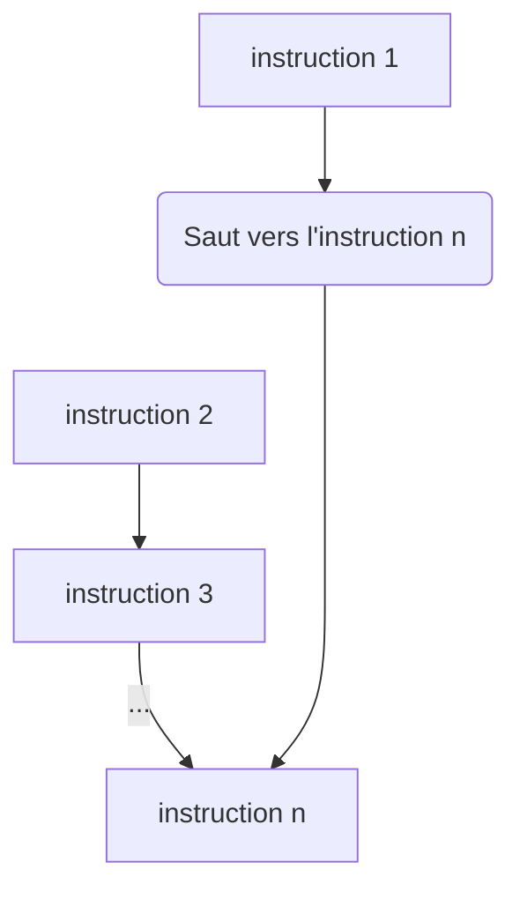

# Structures de contrôle : conditionnelles

## Principe

On peut imaginer qu'un programme est une suite finie de choix, permettant de s'adapter aux situations rencontrées. Ce type de choix s'appelle un branchement conditionnel[^a].

[^a]: Il existe également des branchements inconditionnels qui ont lieu sans qu'aucune condition soit vérifiée (voir schéma ci-dessous où on passe directement de l'instruction 1 à l'instruction n). Nous utiliserons de tels branchements lorsque nous travaillerons sur l'assembleur. Sachez toutefois que ces branchements sont à proscrire en programmation de haut niveau.


!!! tip inline end "_Graphe de contrôle_"
    ```mermaid
    graph TD;
    A-->p("#60;condition à remplir#62;");
    p-->|Vrai|B;
    p-->|Faux|C;
    B-->D[Suite du programme];
    C-->D[Suite du programme];
    class p if;
    ```

!!! {{cours()}}
    Une conditionnelle permet d'effectuer une action si une certaine condition est vérifiée.

!!! tip "Comprendre les conditionnelles"

    Dans les exercices ci-dessous, sur une feuille, dessinez le _graphe de contrôle_ correspondant au programme proposé.

    === {{exercice(False, 0)}}
        Un site de vente en ligne propose la livraison gratuite au-delà de 90€ d'achats. 
        Voici le programme écrit en Français.
        ``` linenums="1"
        prix ← prix du panier
        si prix <= 90€ alors :
            frais_port ← 7€
        sinon :
            frais_port ← 0€
        prix_total ← prix + frais_port
        afficher prix_total
        ```

        Solution[^1] en fin de cours

        [^1]: Cliquez sur la flèche pour revenir au cours
            ```mermaid
            graph TD;
            A["prix ← prix du panier"]-->p("prix <= 90€");
            p-->|Vrai|B["frais_port ← 7€"];
            p-->|Faux|C["frais_port ← 0€"];
            B-->D["prix_total ← prix + frais_port <br /> afficher prix_total"];
            C-->D;
            class p if;
            ```

    === {{exercice(False)}}
        On donne une autre proposition pour le programme de l'exercice 1. 
        Voici le programme écrit en Français.
        ``` linenums="1"
        frais_port ← 0€
        prix ← prix du panier
        si prix <= 90€ alors :
            frais_port ← 7€
        prix_total ← prix + frais_port
        afficher prix_total
        ```

        Solution[^2] en fin de cours

        [^2]: Cliquez sur la flèche pour revenir au cours. On passe directement à la suite du code si la condition est fausse.
            ```mermaid
            graph TD;
            A["frais_port ← 0€ <br /> prix ← prix du panier"]-->p("prix <= 90€");
            p-->|Vrai|B["frais_port ← 7€"];
            p-->|Faux|D;
            B-->D["prix_total ← prix + frais_port <br /> afficher prix_total"];
            class p if;
            ```

    === {{exercice(False)}}
        Un thermostat permet de réguler la température d'un réfrigérateur à 5°C. 
        Voici le programme écrit en Anglais.
        ``` linenums="1"
        temperature ← measuring the inside temperature of the fridge
        if temperature > 5°C then :
            temperature ← temperature - 0.1°C
        else :
            temperature ← temperature + 0.1°C
        go back to the beginning of the program 
        ```

        Solution[^3] en fin de cours

        [^3]: Cliquez sur la flèche pour revenir au cours
            ```mermaid
            graph TD;
            A["temperature ← measuring the inside temp..."]-->p("temperature > 5°C");
            p-->|Vrai|B["temperature ← temperature - 0.1°C"];
            p-->|Faux|C["temperature ← temperature + 0.1°C"];
            B-->D[go back];
            C-->D[go back];
            D-..->A;
            class p if;
            ```

    === {{exercice(False)}}
        Voici un programme écrit en Python. Remarquez que les instructions sont presque les mêmes qu'en Anglais.
        ```python linenums="1"
        age_client = 15
        if age_client <= 12 :
            prix = 5
        else :
            prix = 10
        print(prix)
        ```

        Solution[^4] en fin de cours

        [^4]: Cliquez sur la flèche pour revenir au cours
            ```mermaid
            graph TD;
            A["age_client = 15"]-->p("age_client <= 12");
            p-->|Vrai|B["prix = 5"];
            p-->|Faux|C["prix = 10"];
            B-->D["print(prix)"];
            C-->D;
            class p if;
            ```

    === {{exercice(False)}}
        Voici un programme écrit en Python. Vous pouvez modifier la valeur de `#!python nombre` pour vous aider à comprendre le fonctionnement du programme.
        {{IDE('python2/exo5')}}

        Solution[^5] en fin de cours

        [^5]: Cliquez sur la flèche pour revenir au cours
            ```mermaid
            graph TD;
            A["nombre = 48 <br /> diviseur = 1"]-->p1("nombre % 2 == 0");
            p1-->|Vrai|p2("nombre % 3 == 0")
            p2-->|Vrai|B["diviseur = 6"]-->p4["print(diviseur)"];
            p2-->|Faux|C["diviseur = 2"]-->p4;
            p1-->|Faux|p3("nombre % 3 == 0");
            p3-->|Vrai|D["diviseur = 3"]-->p4;
            p3--->|Faux|p4;
            class p1,p2 if;

!!! {{cours()}}
    !!! tip inline end "_Graphe de controle_"
        ```mermaid
        graph TD;
        A[début code]-->p("condition");
        p-->|Vrai|B[bloc code B];
        p-->|Faux|C[bloc code C];
        B-->D[suite code];
        C-->D;
        class p if;
        ```

    En Python, la syntaxe des instructions conditionnelles est la suivante :
    
    ```python
    début code
    if condition :
        bloc code B
    else :
        bloc code C
    suite code
    ```

    !!! warning "Trois détails importants"

        - comme en Anglais, le test conditionnel est réalisé avec `#!python if/else` ;
        - à la fin d'une ligne contenant `#!python if/else`, on ajoute deux-points `#!python :` ;
        - **tout** le bloc de code B (ou C) doit être indenté avec une tabulation ++tab++.


La clause sinon (`#!python else`) n'est pas obligatoire. Si elle n'est pas précisée, le _bloc code C_ n'est pas défini et on passe directement à la _suite du code_ (voir exercice 2).

Lorsque plusieurs conditions sont imbriquées les unes dans les autres, la syntaxe devient très lourde. Pour faciliter l'écriture et le maintien des programmes, de nombreux langages utilisations une troisième instruction `#!python elif`.

## Booléens : première approche

!!! example "La nature des booléens"

    === "Situation 1"
        Quelqu'un vous dit _4 est égal à 4_. Que lui répondez-vous ?

        ??? help "Réponse"

            _Ben, c'est VRAI_ !

    === "Situation 2"
        Quelqu'un vous dit _7 est égal à 12_. Que lui répondez-vous ?

        ??? help "Réponse"

            _Ben, c'est FAUX_ !


!!! {{cours()}}
    Les booléens constituent la réponse logique à une question. En Python, cette réponse logique ne peut avoir que deux valeurs : `#!python True` ou `#!python False`.

    Pour poser une question, on utilise des symboles mathématiques : `<=`, `<`, `==`, `!=`, `>=`, et `>`.

    !!! warning "Attention"
        Notez bien qu'on teste l'égalité avec un **double égal** et la différence avec **point d'exclamation égal**.


!!! tip "Choisissez la syntaxe correcte"

    === "Question"

        - [ ] Proposition 1
            ```python 
            if nombre_points == 20 :
                niveau = niveau + 1
            ```
        - [ ] Proposition 2
            ```python 
            if nombre_points = 20 :
                niveau = niveau + 1
            ```
        - [ ] Proposition 3
            ```python 
            if nombre_points == 20
                niveau = niveau + 1
            ```
        - [ ] Proposition 4
            ```python 
            if nombre_points == 20 : 
            niveau = niveau + 1
            ```

    === "Réponse"

        - [x] Proposition 1 : correcte !
            ```python 
            if nombre_points == 20 :
                niveau = niveau + 1
            ```
        - [ ] Proposition 2 : attention au double égal.
            ```python 
            if nombre_points = 20 :
                niveau = niveau + 1
            ```
        - [ ] Proposition 3 : attention aux deux-points manquants.
            ```python 
            if nombre_points == 20
                niveau = niveau + 1
            ```
        - [ ] Proposition 4 : attention à la tabulation.
            ```python 
            if nombre_points == 20 : 
            niveau = niveau + 1
            ```             


!!! tip "Exercices"

    === "Choisissez la syntaxe correcte"


## Booléens : seconde approche

Mélanger plusieurs expressions booléennes - FAIRE le lien avec le chapitre 3.
