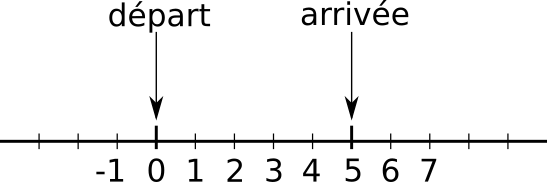

# Structures de contrôle : boucles

## Principe

En programmation, un principe important est le **principe DRY**. Cet acronyme signifie **D**on't **R**epeat **Y**ourself. Il suggère qu'un bon programme informatique ne contient pas de répétitions et évite les copier/coller. 

Si votre programme comporte trop de répétitions, il faut utiliser de nouvelles structures permettant d'éviter cela.

!!! example "Utilité des boucles"

    On veut ajouter quatre pièces de 2€ dans une urne. Voici le programme proposé.

    {{IDE('python3/exo1')}}

    - [ ] Affichez le contenu de l'urne dans le terminal.
    - [ ] Complétez le programme ci-dessus afin d'ajouter 2 nouvelles pièces de 2€ (total de 6 pièces). 
    - [ ] Imaginez que l'on veuille maintenant ajouter 5 nouvelles pièces. Complétez le programme ci-dessus. 
    - [ ] Et pour 7296 nouvelles pièces, comment feriez-vous ?

En programmation, on est amené à répéter de nombreuses fois une même instruction ou bloc d'instructions. On introduit donc une nouvelle structure de contrôle appelée **boucles**.

On distingue :

- les boucles conditionnelles ;
- les boucles inconditionnelles.

## Définition générale

!!! {{cours()}}

    !!! tip inline end "_Graphe de controle_"
        ```mermaid
        graph TD;
        A[début code]-->p("condition");
        p-->|Vrai|B[bloc code A]-->p;
        p-->|Faux|C[suite code];
        class p if;
        ```

    Une boucle est une structure de contrôle permettant de répéter un bloc d'instructions selon une certaine condition.

    Ce type d'instructions est essentielle à tout langage de programmation.

!!! exo "Comprendre l'intérêt des boucles"

    === {{exercice(False, 0)}}
        Le programme suivant comporte-t-il une boucle ? 
        ``` linenums="1"
        Faites fondre le chocolat cassé en morceaux avec le beurre.
        Battez les oeufs avec le sucre jusqu'à ce que le mélange blanchisse.
        Ajoutez la farine, le sucre vanillé, et ajoutez le chocolat.
        Versez le tout dans un moule, et enfournez à 180°C pendant 15 min.
        ```

        ??? help "Solution"

            Ce programme ne comporte pas de boucle. Chaque instruction est exécutée une seule fois.

    === {{exercice(False)}}
        Le programme suivant comporte-t-il une boucle ? 
        ``` linenums="1"
        Pour multiplier 12 par un nombre entier n, on fait :
        resultat = 0              # 0 fois
        resultat = resultat + 12  # 1 fois
        resultat = resultat + 12  # 2 fois
        resultat = resultat + 12  # 3 fois
        ...
        resultat = resultat + 12  # n fois
        ```

        ??? help "Solution"

            Ce programme comporte une boucle. Chaque instruction est répétée `n` fois (`n` peut même être égal à 0!).

            La condition est cachée. On continue tant que l'addition n'a pas été répétée `n` fois.

    === {{exercice(False)}}
        Le programme suivant comporte-t-il une boucle ? 
        ``` linenums="1"
        Mettre l'eau dans le sucre et mettre le plein feu pendant 3 minutes.
        À l'aide d'un thermomètre de cuisson, mesurez la température.
        Tant que la température n'est pas supérieure à 127°C, ajoutez 1 minute de cuisson puis mesurez à nouveau la température.
        Une fois la température supérieure à 127°C, retirez du feu.
        ```

        ??? help "Solution"

            Ce programme comporte une boucle. Une instruction (la mesure de température) doit être répétée autant de fois que nécessaire pour dépasser les 127°C. 
            
            La condition est donc `temperature >= 127°C`.

    === {{exercice(False)}}
        Le programme suivant comporte-t-il une boucle ? 
        ``` linenums="1"
        Pensez à un nombre entier positif n.
        Multipliez le nombre 1 par 2, 
        multipliez le nombre obtenu (2) par 3,
        multipliez le nombre obtenu (6) par 4,
        etc.
        multipliez le nombre obtenu par n
        Vous venez de calculer la factorielle du nombre n !
        ```

        ??? help "Solution"

            Ce programme comporte une boucle. On répète une instruction (la multiplication par un nombre) un certain nombre de fois.
            
            La condition est cachée. On continue tant que le nombre par lequel on multiplie est différent de `n`.

    === {{exercice(False)}}
        Le programme suivant comporte-t-il une boucle ? 
        ``` linenums="1"
        Mettre l'eau dans le sucre et mettre le plein feu pendant 3 minutes.
        À l'aide d'un thermomètre de cuisson, mesurez la température.
        Si la température est supérieure à 127°C, ajoutez 50mL d'eau.
        Mesurez à nouveau la température puis retirez du feu.
        ```

        ??? help "Solution"

            Ce programme ne comporte pas de boucle mais une conditionnelle. Chaque instruction est exécutée une seule fois : on remarque d'ailleurs que la seconde mesure de température ne sert à rien !

## Boucles conditionnelles _while_

La structure de contrôle correspondant le plus au graphe de contrôle du paragraphe 2 est la boucle conditionnelle.

!!! {{cours()}}

    En Python, la syntaxe des boucles conditionnelles est la suivante :
    
    ```python
    début code
    while condition :
        bloc code A
    suite code
    ```

    !!! example "Exemple"

        Tester le code ci-dessous :

        {{IDEv('python3/exemple1')}}

        Pour vous aider à mieux comprendre : [PythonTutor](https://pythontutor.com/visualize.html#code=i%20%3D%200%0A%0Awhile%20i%20%3C%3D%208%3A%0A%20%20%20%20print%28i%29%0A%20%20%20%20i%20%3D%20i%20%2B%202%0A%0Aprint%28%22Valeur%20finale%20de%20i%20%3A%22,%20i%29%0A&cumulative=true&curInstr=0&heapPrimitives=true&mode=display&origin=opt-frontend.js&py=3&rawInputLstJSON=%5B%5D&textReferences=false){target="_blank"}

    Une boucle conditionnelle `#!python while` nécessite donc **trois** éléments pour fonctionner correctement :

    - initialisation de la variable d'itération avant la boucle (ligne 1).
    - condition (expression booléenne) permettant de continuer la boucle ou non (ligne 3).
    - modification de la variable d'itération (appelé parfois incrémentation) (ligne 5).

    ??? {{ext()}}
        Dans les langages permettant la sortie anticipée de boucle (avec `#!python break`, `#!python return` ou `#!c goto`), les boucles conditionnelles peuvent être vues comme inutiles. 
            
        Ce n'est pas le cas des langages fonctionnels dont nous parlerons en Terminale : prenez donc l'habitude d'utiliser ces boucles conditionnelles pour ne pas dépendre du langage Python en particulier.

!!! exo "Manipuler des boucles conditionnelles"

    === {{exercice(False)}}

        - [ ] Lire le programme ci-dessous et prédire son fonctionnement.
        - [ ] Tester le programme afin de vérifier votre prédiction.

        {{IDEv('python3/exo6')}}

        ??? help "Solution" 

            Il affiche les nombres de 1 à 10 inclus. Il affiche un nombre par ligne. 

    === {{exercice(False)}}

        À l'aide d'une boucle conditionnelle, affichez **sur une seule ligne** les nombres de 1 à 10 exclus. 

        On modifiera le programme de l'exercice précédent.
        
        On utilisera l'[option](https://docs.python.org/fr/3/library/functions.html#print){target="_blank"} `#!python print(..., end = " ")` afin d'éviter qu'un affichage nous ramène à la ligne.

        {{IDEv('python3/exo7')}}

    === {{exercice(False)}}

        À l'aide d'une boucle conditionnelle, affichez **sur une seule ligne** les nombres de 10 à 1 inclus.

        On s'inspirera du programme de l'exercice précédent.

        On utilisera l'[option](https://docs.python.org/fr/3/library/functions.html#print){target="_blank"} `#!python print(..., end = " ")` afin d'éviter qu'un affichage nous ramène à la ligne.

        {{IDEv('python3/exo8')}}

    === {{exercice(False)}}

        - [ ] Lire le programme ci-dessous et prédire son fonctionnement.
        - [ ] Tester le programme afin de vérifier votre prédiction.
        - [ ] Réaliser une modification simple permettant de supprimer l'instruction conditionnelle.

        {{IDEv('python3/exo9')}}

    === {{exercice(False)}}

        Dans cet exercice, nous souhaitons programmer à la main $2^n$. 
        
        Remarquons que : $2^n = 1 \times 2 \times 2 \times 2 \times ...\times 2$. 
        
        Avec des parenthèses : $2^n = (...(((1 \times 2) \times 2) \times 2) \times ...\times 2)$
        
        Nous devons d'abord calculer la parenthèse la plus interne ($1 \times 2$). Pour cela, je décide de prendre une variable appelée `#!python accumulateur = 1`. En Python, cela s'écrit : `#!python accumulateur * 2`. Nous référençons le résultat dans la variable `#!python accumulateur` qui vaut à présent 2. 
        
        La formule devient : $2^n = (...((\text{accumulateur} \times 2) \times ...\times 2)$. Nous pouvons réitérer l'opération et faire : `#!python accumulateur * 2`. Nous référençons encore le résultat dans la variable `#!python accumulateur` qui vaut à présent 4 (=$2^2$). Le procédé se poursuit jusqu'à ce que toutes les multiplications soient réalisées.

        Compléter le programme afin qu'il calcule une puissance de 2.

        {{IDEv('python3/exo10')}}

    === {{exercice(False)}}

        Dans cet exercice, nous souhaitons programmer à la main l'opérateur multiplication ! Nous allons nous intéresser à $a\times b$, avec b entier.

        En utilisant la technique de l'accumulateur décrite dans l'exercice 10, compléter le programme ci-dessous calculant la multiplication de deux nombres a et b.

        {{IDEv('python3/exo11')}}

    === {{exercice(False)}}

        La suite de Syracuse est une suite d'entiers naturels définie par : 
        $u_{n+1}=\left \{ \begin{align} \frac{u_n}{2}  & {\rm \quad si}\  u_n \rm{ \ est \ pair}\\ 
            3u_n +1 & {\rm \quad si}\  u_n \rm{ \ est \ impair}\\ 
            \end{align} \right .$

        Il existe une hypothèse dite conjecture de Collatz affirmant que "Pour tout nombre entier n choisi, la suite de Syracuse se terminera sur un cycle 4, 2, 1."

        Par exemple, avec $u_0 = 6$ :

        - $u_1 = \dfrac{6}{2} = 3$ car 6 est pair ; 
        - $u_2 = 3\times3+1 = 10$ car 3 est impair ; 
        - $u_3 = \dfrac{10}{2} = 5$ car 10 est impair ; 
        - $u_4 = 3\times 5 + 1 = 16$; 
        - $u_5 = 8$ ; 
        - $u_6 = 4$ ; $u_7 = 2$ ; $u_8 = 1$.

        - [ ] Écrire un programme permettant de calculer et d'afficher tous les termes de la suite de Syracuse jusqu'à la première apparition d'un 1.
        - [ ] Ajouter un compteur permettant de compter le nombre d'étapes avant l'apparition d'un 1. Ce compteur est appelé le temps de vol.
        - [ ] Quel est le temps de vol associé à [$u_0 = 15$](https://fr.wikipedia.org/wiki/Conjecture_de_Syracuse){target="_blank"} ?

        {{IDEv('python3/exo12')}}

    
    === {{exercice(False)}}

        Que fait le programme suivant ? 

        ```python 
        i = 0
        while i < 10:
            print('Jusque là, tout va bien.')
        ```

        ??? help "Solution" 

            Ce programme affiche `#!python 'Jusque là, tout va bien.'` mais ne s'arrête jamais ! En effet, la valeur de la variable de boucle n'est jamais incrémentée et n'atteint donc jamais 10.

!!! danger "Boucles infinies"

    Dans le cadre des boucles conditionnelles, la question de l'arrêt d'un programme se pose.

    Il faut donc toujours se demander si notre expression booléenne sera vérifiée à un moment du programme.

    Dans un éditeur de code (Thonny, VSCodium...), vous pouvez néanmoins toujours stopper l'exécution d'un script Python à l'aide de la combinaison de touches ++ctrl+c++.

## Boucles inconditionnelles _for_

### Cas général

!!! {{cours()}}

    En Python, la syntaxe des boucles inconditionnelles est la suivante :
    
    ```python
    début code
    for variable_boucle in itérable :
        bloc code A
    suite code
    ```

    !!! question "Qu'est-ce qu'un itérable ?"

        Pour nous, il s'agit d'une **chaîne de caractères** ou d'un **tableau**, car ceux-ci sont composés d'éléments que l'on peut **épeler** : la lettre ou l'élément.

    ???+ example "Exemple 1 (important!)"

        - [ ] Tester le code ci-dessous.
        - [ ] Que fait le code ? Est-ce conforme à notre définition d'un itérable ?

        {{IDEv('python3/exemple2')}}

        Pour vous aider à mieux comprendre : [PythonTutor](https://pythontutor.com/visualize.html#code=i%20%3D%200%0A%20%20%20%20%0Awhile%20i%20%3C%3D%208%3A%0A%20%20%20%20print%28i%29%0A%20%20%20%20i%20%3D%20i%20%2B%202%0A%20%0Aprint%28%22Valeur%20finale%20de%20i%20%3A%22,%20i%29&cumulative=true&curInstr=0&heapPrimitives=true&mode=display&origin=opt-frontend.js&py=3&rawInputLstJSON=%5B%5D&textReferences=false){target="_blank"}

    ???+ example "Exemple 2 (important!)"

        - [ ] Tester le code ci-dessous.
        - [ ] Que fait le code ? Est-ce conforme à notre définition d'un itérable ?

        {{IDEv('python3/exemple3')}}
        
        Pour vous aider à mieux comprendre : [PythonTutor](https://pythontutor.com/visualize.html#code=print%28%22Boucle%20sur%20un%20tableau%20d'entiers%22%29%0A%0Afor%20element%20in%20%5B4,%203,%208,%2012,%2031%5D%3A%0A%20%20%20%20print%28element%29%0A%0Aprint%28'Fin%20de%20la%20boucle%20inconditionnelle'%29%0A&cumulative=true&curInstr=0&heapPrimitives=true&mode=display&origin=opt-frontend.js&py=3&rawInputLstJSON=%5B%5D&textReferences=false){target="_blank"}
  

    ??? {{ext()}}

        Dans le détail, un itérable peut être créé en Python avec la fonction `#!python iter()`. 
        
        On itère sur l'itérable à l'aide de la fonction `#!python next()`. 

        - [ ] Lancer le code ci-dessous et dans la console de l'éditeur ci-contre, écrire `#!python next(iterable)`.
        - [ ] Répéter cette commande et observer le mot en train d'être épelé. La valeur référencée par la variable `#!python lettre` de la boucle `#!python for` est donc définie grâce à un appel à `#!python next()` d'un itérateur.
        - [ ] Remarquer l'erreur `#!python StopIteration` qui apparaît une fois l'itérable complètement épelé.
        - [ ] Modifier `#!python mot ='python'` en `#!python mot = 12345` et réitérer l'itération. Cela fonctionne-t-il ? 

        {{IDEv('python3/exemple4')}}

!!! exo "Application directe"

    === {{exercice(False)}}

        - [ ] Prédire ce que va afficher le programme ci-dessous.
        - [ ] Écrire ce programme dans l'éditeur et l'exécuter. Votre prédiction est-elle correcte ?

        ```python
        for lettre in '54321...':
            print(lettre)
        print("Décollage")
        ```

        {{IDEv('')}}

    === {{exercice(False)}}

        - [ ] Prédire ce que va afficher le programme ci-dessous.
        - [ ] Écrire ce programme dans l'éditeur et l'exécuter. Votre prédiction est-elle correcte ?
        - [ ] Modifier la ligne 3 afin d'afficher une phrase un peu plus correcte.

        ```python linenums="1"
        texte = ""
        for mot in ["Les ", "chaussettes ", "sont-elles ", "sèches ?"]:
            texte = mot + texte
        print(texte)
        ```

        {{IDEv('python3/exo15')}}

    === {{exercice(False)}}

        Voici un tableau d'acteurs : `#!python tableau_acteurs = ['Tahar', 'Omar', 'Guillaume', 'Swann', 'Alex', 'Roschdy']`.

        Utiliser ce tableau pour obtenir l'affichage suivant : 

        ```bash
        Tahar a eu le César du meilleur acteur
        Omar a eu le César du meilleur acteur
        Guillaume a eu le César du meilleur acteur
        Swann a eu le César du meilleur acteur
        Alex a eu le César du meilleur acteur
        Roschdy a eu le César du meilleur acteur
        ```

        {{IDEv('python3/exo16')}}

    === {{exercice(False)}}

        - [ ] Prédire ce que va afficher le programme ci-dessous.
        - [ ] Écrire ce programme dans l'éditeur et l'exécuter. Votre prédiction est-elle correcte ?

        ```python linenums="1"
        n = 3
        for lettre in "abcd":
            n = n + 2
        print(n)
        ```

        {{IDEv('python3/exo17')}}

        ??? help "Remarque"

            On remarque qu'on vient de répéter la même opération 4 fois car l'itérable est composé de 4 lettres.


    === {{exercice(False)}}

        On dispose d'un tableau d'entiers : `#!python tableau = [1, 2, 3, 4, 5]`. 

        Écrire un programme qui, à l'aide d'une boucle inconditionnelle, réalise l'addition de 1, 2, 3, 4 et 5. Pensez à l'accumulateur de l'exercice 10.

        {{IDEv('python3/exo19')}}

        ??? help "Aide"

            Il s'agit d'utiliser une variable `#!python accumulateur` qui va être initialisée à 0. On va ensuite calculer `#!python accumulateur * nombre` et référencer le résultat par la variable `#!python accumulateur`.

    === {{exercice(False)}}

        On dispose d'un tableau d'entiers : `#!python tableau = [10, 20, 30, 40]`. Nous souhaitons tirer et afficher quatre nombres aléatoires entre 0 et 10, 10 et 20, 20 et 30 et 30 et 40.

        Le début de programme ci-dessous vous montre comment tirer des nombres de manière aléatoire. Modifier ce programme à l'aide d'une boucle inconditionnelle `#!python for`. 

        {{IDEv('python3/exo20')}}

        ??? help "Aide"

            Remarquez que à chaque étape l'ancienne valeur maximum est devenue la valeur minimum : `#!python valeur_mini = valeur_maxi`. Cela vous donne une règle à suivre dans la boucle inconditionnelle.


### Cas de _range_

!!! example "Répétition d'instruction"

    Savoir parcourir un itérable est très pratique mais nous limite beaucoup. Souvent, nous souhaitons :
    
    - connaître le numéro de la lettre courante (par exemple, dans le mot "Venom", `#!python V` est la lettre d'**indice** 0, `#!python e` la lettre d'**indice** 1 etc.) ;
    - pouvoir répéter un nombre déterminé de fois une action.

    Par exemple, dans le code ci-dessous, nous répétons une phrase 5 fois :
    
    {{IDEv('python3/exemple5')}}

!!! {{cours()}}

    Un itérable occupe une place très particulière : il s'agit de `#!python range(n)`.     
    
    Faire parcourir à une variable `#!python k` l'itérable `#!python range(n)` va lui faire prendre successivement les valeurs 0, 1, 2, ..., **n-1**.

    Lancer le programme ci-dessous :

    {{IDEv('python3/exemple6')}}


    ???+ help "Remarque"

        k va de 0 à **n-1**. Il y a donc bien n valeurs qui sont parcourues.

    Lorsque l'on itère sur `#!python range`, la variable de boucle est souvent nommé `#!python i`, `#!python j` ou `#!python k`.

!!! exo "Manipulation de _range_"

    === {{exercice(False)}} 

        Faire afficher la séries de nombres ci-dessous.
        
        On utilisera la syntaxe `#!python print(k, end = ' ')` pour afficher les nombres horizontalement.

        ```python
        0 1 2 3 4 5
        ```

        {{IDEv('python3/exo20b')}}
    
    === {{exercice(False)}} 

        Faire afficher la séries de nombres ci-dessous.
        
        On utilisera la syntaxe `#!python print(k, end = ' ')` pour afficher les nombres horizontalement.

        ```python
        5 6 7 8 9 10
        ```

        {{IDEv('python3/exo21')}}

    === {{exercice(False)}} 

        Faire afficher la séries de nombres ci-dessous.
        
        On utilisera la syntaxe `#!python print(k, end = ' ')` pour afficher les nombres horizontalement.

        ```python
        1 4 7 10 13 16 19 22
        ```

        {{IDEv('python3/exo22')}}
    
    === {{exercice(False)}} 

        Faire afficher la séries de nombres ci-dessous.
        
        On utilisera la syntaxe `#!python print(k, end = ' ')` pour afficher les nombres horizontalement.

        ```python
        10 9 8 7 6 5 4 3 2 1 0
        ```

        {{IDEv('python3/exo23')}}


<!-- Introduire la syntaxe len, range -->


### Itérable ou _range_ ?

Comment choisir entre `#!python for i in itérable` ou `#!python for i in range(n)` ?

!!! {{cours()}}

    Le critère est simple : 
    
    - si on s'intéresse au contenu d'un itérable (par exemple, aux lettres d'un mot), on va parcourir l'itérable ;
    - si on s'intéresse à du comptage ou à la position des valeurs dans l'itérable, on va utiliser `#!python range`.


!!! exo "Itérable ou `#!python range` : faites le bon choix !"

    === {{exercice(False)}}

        Écrire un programme qui affiche les lettres du mot "Artiste".

        {{IDEv('python3/exo24')}}

    === {{exercice(False)}}

        Écrire un programme qui affiche la table de multiplication de 7. On obtiendra l'affichage suivant :
        ```python 
        7 x 0 = 0
        7 x 1 = 7
        ...
        7 x 10 = 70
        ```

        {{IDEv('python3/exo25')}}


    === {{exercice(False)}}

        Écrire un programme qui affiche [`#!python In the castle of AAAAArrrrrggggghhhhh`](https://www.youtube-nocookie.com/embed/ZlIz0q8aWpA?autoplay=1&iv_load_policy=3&loop=1&modestbranding=1&playlist=ZlIz0q8aWpA){target = "_blank"}. On pourra partir du mot 'Argh' où l'on répétera 5 fois chaque lettre.

        {{IDEv('python3/exo26')}}


## Boucles imbriquées

!!! {{cours()}}

    Il est très souvent utile d'imbriquer une boucle dans une autre, notamment lors du parcours de tous les pixels d'une image.

    !!! example "Exemple"

        {{IDE('python3/exemple7')}}


## Exercices récapitulatifs

!!! {{cours()}}

    On utilise une boucle conditionnelle quand on ne connaît pas à l'avance le nombre de répétitions.

    On utilise une boucle inconditionnelle quand on veut épeler des éléments un à un ou que l'on connaît le nombre de répétitions à effectuer, 

!!! {{exercice()}}

    Sur un jeu d'échecs, les cases sont repérées par une lettre (de A jusqu'à H) et par un chiffre (de 1 jusqu'à 8).

    Les cases sont donc A1, A2, A3, ..., H7, H8.

    Proposer un code qui affiche toutes les cases possibles.

    {{IDE('python3/exo27')}}

!!! {{exercice()}}

    En Python, la fonction `#!python ord` renvoie le [code Unicode](https://fr.wikipedia.org/wiki/Unicode){target = "_blank"} d'un caractère et la fonction `#!python chr` le contraire: elle renvoie le caractère correspondant à un code Unicode.

    Par exemple:
    ```python
    >>> ord('a')
    97
    >>> chr(97)
    'a'
    ```

    Voici une liste contenant les codes Unicode des lettres d'un mot secret... Écrire un programme où en sortie, la variable mot_secret contiendra la chaîne de caractères de ce mot.

    {{IDE('python3/exo28')}}

!!! {{exercice()}}

    On imagine une puce qui se déplace aléatoirement sur une ligne, en avant ou en arrière, par pas de 1 ou -1. 
    
    Par exemple : 
    
    - si elle est à l'emplacement 0, elle peut sauter à l'emplacement 1 ou -1 ; 
    - si elle est à l'emplacement 2, elle peut sauter à l'emplacement 3 ou 1.

    Avec la boucle de votre choix, simuler le mouvement de cette puce de l'emplacement initial 0 à l'emplacement final 5 (voir le schéma de la figure). 
    
    Afficher le nombre de sauts nécessaires pour réaliser ce parcours. 
    
    Relancer plusieurs fois le programme. Trouve-t-on le même nombre de sauts à chaque exécution ?

    {: style="width:40%;"}

    !!! help "Générer des nombres aléatoires"
        Afin de générer des nombres aléatoires, nous importons le module `#!python random`. Le programme proposé utilise également l'instruction `#!python random.choice([-1, 1])` qui renvoie au hasard la valeur -1 ou 1 avec une probabilité $\dfrac{1}{2}$. 
    
        Nous reverrons la signification de cette syntaxe particulière dans le chapitre sur la [modularité](python6.md).
    
    {{IDE('python3/exo29')}}


!!! conclu "Résumé"

    Dans ce chapitre, j'ai appris : 
    
    - [ ] l'intérêt des boucles dans la cadre du principe DRY ;
    - [ ] l'existence de boucles conditionnelles et inconditionnelles ; 
    - [ ] comment utiliser les boucles conditionnelles ;
    - [ ] comment parcourir les valeurs d'un itérable avec une boucle inconditionnelle ; 
    - [ ] comment parcourir les indices d'un itérable avec une boucle inconditionnelle.