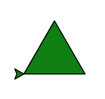
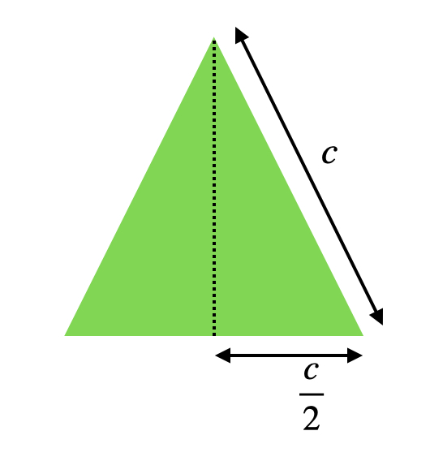

# Fonctions

Ce chapitre est la **pierre angulaire** de tout langage informatique !

Pour tous les exercices, vous pouvez valider vos réponses avec le petit gendarme : votre fonction sera alors **testée** sur des cas de base. Ces cas vous aident à comprendre pourquoi votre fonction n'a pas encore le fonctionnement attendu.

## Principe

!!! exo "Pourquoi les fonctions ?"

    Les lignes suivantes permettent de convertir une température de degré _Fahrenheit_ vers degré _Celsius_.

    ```python
    temp_fahrenheit = 60
    temp_celsius = temp_fahrenheit - 32 * (5/8)
    ```

    - [ ] Dans le terminal ci-dessous, tester ce programme pour convertir 60 degrés Fahrenheit en degrés Celsius. Afficher la valeur référencée par la variable `#!python temp_celsius`. **Pro tip** : dans la console, utiliser la touche ++tab++ pour compléter un mot dont vous aurez écrit le début. `#!python temp_f` + ++tab++ doit écrire `#!python temp_fahrenheit`.
    - [ ] On souhaite maintenant convertir 90 et 120 degrés Fahrenheit en degrés Celsius. Ajouter les lignes correspondantes.

    {{terminal()}}

    ??? help "Solution"

        ```python
        temp_fahrenheit = 60
        temp_celsius = temp_fahrenheit - 32 * (5/8)
        print(temps_celsius)
        temp_fahrenheit = 90
        temp_celsius = temp_fahrenheit - 32 * (5/8)
        print(temps_celsius)
        temp_fahrenheit = 120
        temp_celsius = temp_fahrenheit - 32 * (5/8)
        print(temps_celsius)
        ```
        
        On remarque qu'il y a beaucoup de répétitions dans le code, même si nous avons utilisé des variables. Notez que l'on pourrait éventuellement utiliser une boucle : 

        ```python
        for temp_fahrenheit in [60, 90, 120]:
            temp_celsius = temp_fahrenheit - 32 * (5/8)
            print(temps_celsius)
        ```

        Il est toutefois difficile de comprendre ce que fait ce programme.

Le **principe DRY** va encore être ici à l'oeuvre : la structure _fonction_ va permettre de simplifier un programme en évitant les répétitions inutiles et complexes à débogger. Cette structure va rendre également le code plus _abstrait_.

!!! {{cours()}}

    Une _fonction_ permet de créer des blocs d'instructions que nous pouvons réutilisons quand nous le souhaitons. C'est une boite noire indépendante du reste d'un programme :

    - nous pouvons la tester et contrôler son fonctionnement de manière indépendante ;
    - elle découpe le problème en sous-problème plus simple à résoudre ;
    - nous pouvons la réutiliser dans d'autres programmes.

    ???+ example "Exemple"

        Pour construire une voiture, on ne fait pas tout en même temps :
        
        - on a par exemple besoin de convertir de l'énergie thermique (ou électrique) en énergie mécanique. Pour cela, on "crée" une fonction nommée `#!python convertir_énergie_thermique_en_énergie_mécanique` qu'on appelle aussi le moteur ;
        - la conversion de l'énergie thermique en énergie mécanique va fonctionner car le moteur a été testé de manière indépendante lors du développement du modèle de voiture ;
        - on le réutilise ensuite pour la production à la chaîne.

    Nous nommerons nos _fonctions_ avec des noms d'action : `#!python calculer_moyenne`, `#!python trier_tableau` ou `#!python afficher_résultats`.


## Définir une fonction

!!! {{cours()}}

    Pour définir une fonction en Python, on utilise la syntaxe suivante :
    ```python 
    def nom_de_la_fonction(parametre1, parametre2, ... ):
        ... instructions ...
        ... instructions ...
        ... instructions ...
        return résultat1, résultat2, ...
    ```

    Une fois `#!python def`inie, la fonction appelée `#!python nom_de_la_fonction` peut être utilisée n'importe où dans le programme.

    En Python, l'indentation des instructions appartenant à la fonction est **obligatoire**.

    !!! danger "Important"
    
        `#!python return` est l'instruction permettant de renvoyer des résultats en dehors de la fonction. 
        
        Toute variable non renvoyée par `#!python return` sera perdue dans la boîte noire !

!!! danger "Important"
    
    Dans ma grande bonté, je vous propose quelquefois des fonctions où seul le titre es présent (on appelle cela un prototype). 
    
    Pour éviter une erreur, le mot-clé `#!python pass` apparaît dans la fonction : il indique à Python de ne rien faire. Quand vous commencez à écrire la fonction, supprimez `#!python pass`.

Nous allons tout de suite étudier divers cas particuliers importants.

## Exemple de fonctions

### Fonction sans paramètres

Les fonctions sans paramètres sont des **raccourcis** pour éviter de retaper plusieurs fois les mêmes instructions. Leur utilité est très limitée : si vous les utilisez, ce sera pour des utilisations très spécifiques.

!!! exo "Exercice"
    === {{exercice(False, 0)}}

        On donne la fonction ci-dessous.

        - [ ] Exécuter le programme.
        - [ ] Dans la console, écrire `#!python compter()` (on dit que vous **appelez** la fonction `#!python compter()`).
        - [ ] Observer le résultat et expliquer celui-ci.
        - [ ] Dans la console, faire deux autres appels à la fonction `#!python compter()`. Que remarquez-vous ?

        {{IDEv("python4/exemple1")}}

        ??? help "Explications"

            Quand vous avez appelé la fonction dans la console, Python a regardé quelque part dans la mémoire s'il existait une fonction appelée `#!python compter()`. Il l'a trouvé car nous avons exécuté le programme : ensuite la fonction se déroule. 
            
            Cette fonction affiche des informations et ne renvoie aucune valeur : on lui demande de renvoyer la valeur `#!python None`.


    === {{exercice(False)}}

        On donne la fonction ci-dessous.

        - [ ] Sans l'exécuter, dire ce que permet de faire la fonction écrite dans l'éditeur.
        - [ ] Exécuter le programme.
        - [ ] Dans la console, afficher la valeur de `#!python vitesse_lumière`.
        - [ ] Modifier le programme en remplaçant la ligne 5 par `#!python vitesse_lumière = c`. Exécuter le programme et comprendre l'erreur affichée.

        {{IDEv("python4/exo2")}}

        ??? help "Remarque importante"

            Une variable peut référencer la valeur renvoyée par une fonction. C'est ce que fait : `#!python vitesse_lumière = calculer_célérité()`. 
            
            Remarquez toutefois que lorsque vous avez écrit `#!python vitesse_lumière = c`, vous avez obtenu une erreur : `#!python NameError: name 'c' is not defined`. Cela signifie que la variable `#!python c` n'existe pas en dehors de la fonction.

    === {{exercice(False)}}

        La course des Animaux est un jeu qui permet de déplacer trois types d'animaux sur un plateau : 
        
        - le Zèbre a 1 chance sur 2 de se déplacer de 6 cases ou de reculer d'une case ;
        - le Lion a 1 chance sur 2 de se déplacer de 5 cases ou de ne pas se déplacer du tout ;
        - l'Éléphant a 1 chance sur 4 de se déplacer de 4 cases, et sinon, il se déplace de 2 cases.  
         
        En vous inspirant de la fonction ci-dessous, écrire une fonction `#!python calculer_déplacement_lion` et `#!python calculer_déplacement_éléphant` permettant de calculer le déplacement du Lion et de l'Éléphant.

        {{IDE("python4/exo3")}}

    === {{exercice(False)}}

        - [ ] Compléter la fonction `#!python placer_aléatoirement`. Elle renvoie :  
            - un entier aléatoire `#!python x` compris entre 0 et 700 ;
            - un entier aléatoire `#!python y` compris entre 0 et 400. 
        - [ ] Compléter la fonction `#!python choisir_couleur`. Elle renvoie :
            - `#!python 'red'` si n vaut 0 ; 
            - `#!python 'green'` si n vaut 1 ; 
            - `#!python 'blue'` si n vaut 2 ; 
            - `#!python 'purple'` si n vaut 3.
        - [ ] Exécuter le script. Dans la console, appeler la fonction `#!python créer_tache` et observer le résultat. Comprendre l'affichage.
        - [ ] Dans la console, faire une boucle inconditionnelle appelant 10 fois la fonction `#!python créer_tache`.
             
        {{IDEv("python4/exo4")}}

        ??? help "Aide"
            Se rappeler la syntaxe des boucles inconditionnelles `#!python for _ in range(10)`.

### Fonction avec paramètres

!!! {{cours()}}

    !!! example "Exemple"

        - [ ] Exécuter le code.
        - [ ] Dans la console, taper `#!python compter(5)` puis `#!python compter(10)`.

        {{IDEv('python4/exemple2')}}

    - La valeur n est appelée **paramètre** de la fonction `#!python compter`.
    - On dit qu'on **passe** le paramètre n à la fonction `#!python compter`.
    - Lorsque vous avez tapé `#!python compter(5)` da,ns la console, vous avez **appeler** la fonction `#!python compter` avec l'**argument** 3.

    ??? {{ext()}}

        Les annotations permettent de préciser à un utilisateur extérieur quel est le type des paramètres. Attention, cela n'impose pas le type du paramètres, c'est simplement une indication !

        Pour indiquer que n est entier, on peut par exemple écrire :
        ```python
        def compter(n : int):
            ...
        ```

        Pour plusieurs paramètres a flottant et n entier, on pourrait écrire :
        ```python
        def multiplier(a: float, n: int):
            ...
        ```

        Nous le reverrons au chapitre 8 !


!!! exo "Exercices"

    === {{exercice(False)}}

        - [ ] Écrire une fonction `#!python f` qui prend en paramètre un nombre flottant `#!python x` et qui renvoie le nombre flottant `#!python 2 * x + 1`.
        - [ ] Tester la fonction avec l'icône gendarme.

        {{IDEv('python4/exo5')}}

    === {{exercice(False)}}

        - [ ] Compléter la fonction `#!python calculer_aire_rectangle` qui prend en paramètre deux nombres flottants `#!python longueur` et `#!python largeur` et qui renvoie l'aire du rectangle.
        - [ ] Ajouter une fonction `#!python calculer_volume_boite` qui prend en paramètre trois nombres flottants `#!python longueur`, `#!python largeur` et `#!python hauteur` et qui renvoie le volume d'une boite.
        - [ ] Valider votre résultat avec l'icône gendarme !

        {{IDEv('python4/exo6')}}

    === {{exercice(False)}}

        - [ ] Écrire une fonction `#!python est_divisible_par` qui prend en paramètre deux nombres entiers positifs `#!python entier` et `#!python diviseur` et qui renvoie `#!python True` si `#!python entier` est divisible par `#!python diviseur`.

        {{IDEv('python4/exo8')}}


    === {{exercice(False)}}

        - [ ] Écrire une fonction `#!python valider_email` qui prend en paramètre une chaîne de caractères `#!python email`.

            Cette fonction renvoie `#!python True` si la chaîne de caractères contient un arobase `#!python @`. Une fois le parcours de l'adresse email avec une boucle inconditionnelle terminée, on renverra `#!python False` si l'arobase n'a pas été trouvé.
        - [ ] Vérifier votre fonction en appelant par exemple `#!python valider_email("titou_du_01@live.fr")`.
        - [ ] Valider avec l'icône gendarme.

        {{IDEv('python4/exo7')}}


    === {{exercice(False)}}

        - [ ] Écrire une fonction `#!python sommer` qui prend en paramètre un tableau non vide d'entiers `#!python tableau`. Cette fonction renvoie la somme des entiers présents dans ce tableau.
        - [ ] Ajouter une fonction `#!python moyenner` qui prend en paramètre un tableau non vide d'entiers `#!python tableau` ainsi que son nombre d'éléments `#!python taille`. Cette fonction renvoie la moyenne des entiers présents dans ce tableau. Dans cette fonction, on utilisera la fonction `#!python sommer` définie précédemment.

        {{IDEv('python4/exo9')}}


    === {{exercice(False)}}

        - [ ] Écrire une fonction `#!python trouver_maximum_2` qui prend en paramètre deux entiers `#!python a` et `#!python b`. Cette fonction renvoie la valeur du plus grand des deux entiers.
        - [ ] Exécuter le programme puis tester votre fonction dans la console avant de le valider avec le gendarme.

        {{IDEv('python4/exo10')}}


    === {{exercice(False)}}

        - [ ] Écrire une fonction `#!python trouver_maximum_3` qui prend en paramètre deux entiers `#!python a`,  `#!python b` et `#!python c`. Cette fonction renvoie la valeur du plus grand des trois entiers. On pourra utiliser la fonction précédente `#!python trouver_maximum_2`.
        - [ ] Exécuter le programme puis tester votre fonction dans la console avant de le valider avec le gendarme.

        {{IDEv('python4/exo11')}}

        ??? help "Aide"

            Pour trouver le maximum entre trois nombres, on veut trouver le maximum M entre deux nombres a et b puis trouver le maximum entre M et le dernier nombre c.

### Et si on n'a rien à renvoyer ?

!!! {{cours()}}

    On a toujours quelque chose à renvoyer : en l'absence de valeurs à renvoyer, on écrira, `#!python return None`.

    ??? {{ext()}}

        En pratique, `#!python return None` n'est pas obligatoire. Si une fonction ne contient pas le mot-clé `#!python return`, Python rajoutera gentiment (et automatiquement) `#!python return None` à la fin de votre fonction lors de l'interprétation du programme.

        `explicit is better than implicit` : écrivez toujours `#!python return None`.

!!! exo "Exercices"

    === {{exercice(False)}}

        - [ ] Écrire une fonction `#!python f` qui prend en paramètre un nombre flottant `#!python x` et qui **affiche** le nombre flottant `#!python x**2 + 1`.
        - [ ] Réaliser les opérations suivants : `#!python y = f(2)` puis `#!python print(y)` ? Expliquer le résultat.

        {{IDEv('python4/exo12')}}

        ??? help "Explications"

            `#!python print(f(2))` affiche :
            
            ```python
            >>> y = f(2)
            5
            >>> print(y)
            None
            ```
            
            L'appel `#!python y = f(2)` se décompose en :
            - en évaluation du résultat de ma fonction f(2) : c'est un affichage de `#!python 2**2 + 1`, suivi du renvoi de `#!python None` comme résultat ;
            - `#!python y` référence la valeur renvoyée (`#!python None`)

            `#!python print(y)` affiche donc bien `#!python None` !

    === {{exercice(False)}}

        !!! tip inline end "Dessin à obtenir"

            {: style="width:50%"}

        - [ ] Compléter la fonction `#!python triangle` qui prend en paramètre :
         
            - une tortue graphique `#!python tortue` ;
            - la longueur `#!python côté` du triangle ;
            - l'abscisse initiale `#!python x` de la tortue ;
            - l'ordonnée initiale `#!python y` de la tortue.
           
            Cette fonction dessine un triangle équilatéral de couleur verte dont le sommet en bas à gauche a pour coordonnées $(x, y)$.

        - [ ] Exécuter votre programme et tester votre fonction dans la console.

        ??? danger "Important"

            N'oubliez pas le `#!python return None` !!!

        {{IDEv('python4/exo13')}}

    === {{exercice(False)}}

        !!! tip inline end "Dessin à obtenir"

            {: style="width:50%"}

        - [ ] Écrire une fonction `#!python calculer_hauteur` qui prend pour paramètre un côté `#!python côté` et renvoie la hauteur d'un triangle équilatéral de côté c.

        - [ ] À l'aide des fonctions `#!python calculer_hauteur` et `#!python triangle`, créer la fonction `#!python nucléaire` ayant pour paramètre une tortue graphique `#!python tortue` et le côté `#!python côté`. Le centre du symbole nucléaire est $(0,0)$.

        ??? help "Aide 1"

            !!! tip inline end "Dessin"

                {: style="width:50%"}

            La hauteur d'un triangle équilatéral peut se calculer facilement en découpant le triangle équilatéral en deux triangles rectangles. On applique alors le théorème de Pythagore. Faites un dessin !!

        ??? help "Aide 2"

            Les maths ne sont pas votre truc. Voici la formule : $h = \dfrac{\sqrt{3}}{2} c$.

        ??? danger "Important"

            Avez-vous penser au `#!python return None` !!! J'y tiens. Vraiment. Pour de vrai.

        {{IDEv('python4/exo14')}}


<!-- - [ ] Écrire une fonction `#!python calculer_hauteur`  l'aide de la fonction `#!python triangle`, créer les fonctions :

- [ ] À l'aide de la fonction `#!python triangle`, créer les fonctions :

    - `#!python nucléaire` ayant pour paramètre une tortue graphique `#!python tortue` et le côté `#!python côté`;
    - `#!python triforce` ayant pour paramètre une tortue graphique `#!python tortue` et le côté `#!python côté`;
    - `#!python sapin` ayant pour paramètre une tortue graphique `#!python tortue` et le nombre de `#!python niveau` du sapin. La taille est divisée par $\dfrac{1}{3} pour passer d'un niveau à l'autre.

    

- [ ] Tester vos fonctions dans la console.
- [ ] Mention spéciale à ceux qui arrivent à mettre des boules de couleur aléatoire sur le sapin !


{{IDEv('python4/exo14')}}  -->


## Utilisation de `#!python return`

!!! {{cours()}}

    Dans une seule fonction, il est possible de renvoyer plusieurs valeurs avec `#!python return`. 
    
    Il suffit d'utiliser la syntaxe : `#!python return valeur1, valeur2, valeur3 ...`.

    ???+ example "Exemple"

        {{IDEv('python4/exemple3')}}

    Il est également possible de mettre plusieurs `#!python return` dans une seule fonction.

    Dans ce cas, `#!python return` est comme un siège éjectable : dès que le programme voit une instruction commençant par `#!python return`, la fonction s'arrête !

    ???+ example "Exemple"

        {{IDEv('python4/exemple4')}}

        `#!python texte` est très différent de `#!python phrase`. En effet, `#!python texte` et `#!python lettre` sont les paramètres de la fonction, comme le $x$ de $f(x)$ en Maths.

        `#!python "a"` et `#!python phrase`sont les arguments de la fonction, comme $2$ de $f(2)$ en Maths. Ce sont eux qui vont être analysés par la fonction.

        Finalement, `#!python caractère` est une simple variable de boucle qui n'existe que dans la fonction.


!!! danger "Danger mortel"

    N'oubliez pas le `#!python return` ! Si vous n'utilisez que des `#!python print`, vous ne faîtes que de **l'affichage** : les résultats de ces fonctions ne pourront en aucun cas être réutilisés dans un autre calcul !

!!! exo "Exercices sur `#!python return`"

    === {{exercice(False)}}

        On propose ci-dessous la fonction `#!python trouver_pair` qui prend pour paramètre un `#!python tableau` d'entiers et qui renvoie 
        
        - le booléen `#!python True` si un entier pair est présent dans le `#!python tableau` ;
        - le booléen `#!python False` sinon.

        - [ ] Exécuter le code ;
        - [ ] Dans la console, appeler la fonction `#!python trouver_pair` sur les tableaux `#!python [1, 3, 5]`, `#!python [8, 4, 10]` et `#!python [5, 20, 5]`. Que fais réellement cette fonction ?
        - [ ] Corriger la fonction pour obtenir le comportement attendu.

        {{IDEv('python4/exo15')}}

    === {{exercice(False)}}

        - [ ] Écrire une fonction `#!python trouver_répétition` qui prend pour paramètre une chaîne de caractères `#!python lettre` et une chaîne de caractères `#!python texte`.

            Cette fonction renvoie :
        
            - le booléen `#!python True` **dès que** la lettre `#!python lettre` est répétée plus d'une fois ;
            - le booléen `#!python False` sinon.

        - [ ] Exécuter le code ;
        - [ ] Dans la console, à l'aide de la fonction `#!python trouver_répétition`, vérifier si la lettre `#!python "A"` est répétée dans la chaîne d'ADN "ACCACGAC", vérifier également que la lettre `#!python "G"` n'est pas répétée et que la lettre `#!python "T"` n'est pas répétée.

        ??? help "Aide" 

            Pensez à l'arrêt anticipé d'une boucle à l'aide d'un `#!python return`.

        {{IDE('python4/exo16')}}

    === {{exercice(False)}}

        - [ ] Écrire une fonction `#!python translater` qui prend pour paramètre deux entiers `#!python vec_x` et `#!python vec_y` (coordonnées d'un vecteur) et deux entiers `#!python a` et `#!python b` permettant de réaliser une translation de vecteur $(\vec a, \vec b)$. Cette fonction renvoie donc deux entiers résultant de la somme des abscisses et de la somme des ordonnées.

        ??? help "Aide" 

            Pensez à la syntaxe `#!python valeur1, valeur2`.

        {{IDE('python4/exo17')}}


    === {{exercice(False)}}

        - [ ] Écrire une fonction `#!python générer` qui prend pour paramètre un entier `#!python nombre_bit` . Cette fonction génère aléatoirement un nombre binaire de `#!python nombre_bit` bits, sous forme de chaîne de caractères. On utilisera un accumulateur et on utilisera `#!python str(random.randint(0,1))` pour générer des bits aléatoires sous forme de chaîne de caractères.
        - [ ] Écrire une fonction `#!python décoder` qui prend pour paramètre un nombre binaire `#!python nombre_binaire` écrit sous forme d'une chaîne de caractères. Cette fonction compte le nombre de 0 et le nombre 1 et renvoie quel bit apparaît le plus grand nombre de fois ainsi que le nombre d'apparitions.

        ??? help "Aide 1"

            On veut ajouter un nouveau bit à l'accumulateur un nombre exact de fois. Utilisez une boucle inconditionnelle.

        ??? help "Aide 2"

            Pensez à la syntaxe `#!python valeur1, valeur2`.

        {{IDE('python4/exo18')}}

## Variables locales et globales

!!! {{cours()}}

    On appelle portée d'une variable l'ensemble des endroits du programme où elle existe.
    Most frequently, name resolution relies on an "inner-to-outer context" rule, such as the Python LEGB (Local, Enclosing, Global, Built-in) rule: names implicitly resolves to the narrowest relevant context. In some cases name resolution can be explicitly specified, such as by the global and nonlocal keywords in Python; in other cases the default rules cannot be overridden.
Global : uniquement pour les constantes pour éviter les EFFETS de BORD 


!!! exo "Exo à réutiliser"

    Le programme suivant permet de comparer la longueur des deux mots "classique" et "clanique". Il affiche une phrase-réponse comparant le nombre de lettres dans les deux mots. 

    {{IDE('python4/exo1')}}

    Dans le même programme, on souhaite aussi comparer la longueur des mots "moderne" et "baderne". Modifiez le code précédent pour réaliser cela.

    ??? help "Solution"

        {{IDE('python4/corr_exo1')}}

## Documentation d'une fonction

!!! {{cours()}}

    Nommer clairement une fonction est fondamental mais il convient également de **documenter** toutes les fonctions que vous faites.

    Documenter permet d'expliquer aux personnes qui ne sont pas familières avec vos fonctions de les comprendre : 

    - que fait-elle ?
    - de quels types sont les paramètres ?
    - un petit exemple.

    Attention à ne pas trop documenter !

    ???+ example "Exemple"

        === "Trop de documentation"
            ```python
            def calculer_carré(x):
                """Calcule le carré d'un nombre

                Paramètres :
                x -- flottant ou entier

                Exemple :
                nombre = calculer_carré(2.0)
                """
                return x**2
            ```

        === "Documentation correcte"
            ```python
            def calculer_carré(x):
                """Calcule le carré d'un nombre flottant ou entier"""
                return x**2
            ```

        === "Trop peu de documentation"
            ```python
            def f(x):
                return x**2
            ```

        === "Incompréhensible"
            ```python
            f = lambda _ : _**2
            ```

    Souvent... **Vous** allez être la personne nécessitant la documentation. Rien de plus frustrant que de revenir sur un de vos codes non documenté et de passer quelques heures à retrouver comment il fonctionne.

    {: style="width:40%"}
    {: style="width:45.2%"}

!!! exo "Exercice"

    === {{exercice(False)}}

        def appartenir_cercle(x, y, R):


## Résumé

!!! danger "Résumé"

    Dans ce chapitre, j'ai appris : 
    
    - [ ] blabla
    - [ ] blabla
    - [ ] blabla
    - [ ] blabla
    - [ ] blabla

!!! danger "Une anecdote"

    En 1973, un robot est envoyé sur la Lune pour collecter des données. Celui-ci, une fois arrivé, affiche les données sur son écran avec l'équivalent de `#!python print`. 
    
    Rien n'a été renvoyé sur Terre car l'équivalent de `#!python return` n'a pas été utilisé ! 
    
    En général, on souhaite faire quelque chose de nos données, pas les afficher.


  <!-- - [ ] Écrire une fonction `#!python valider_code_sécu` qui prend en paramètre deux nombres entiers positifs `#!python entier` et `#!python diviseur` et qui renvoie `#!python True` si `#!python entier` est divisible par 'aire du rectangle. -->
