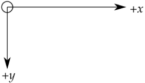
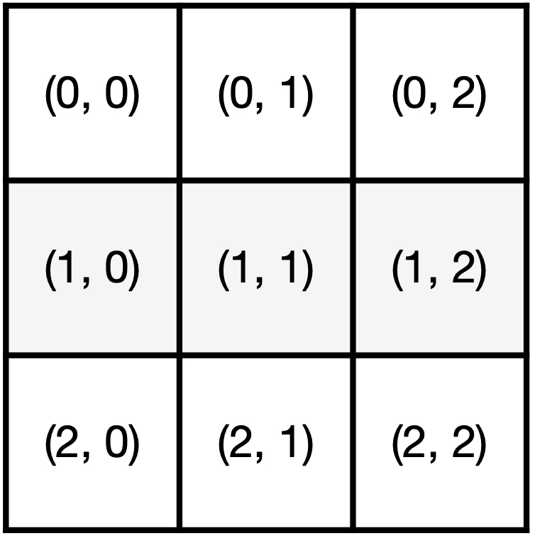

# TP 12 : Programmation évènementielle

!!! {{cours()}}

    Python propose de la programmation évènementielle. Ce style de programmation (aussi appelé **paradigme**) permet de gérer des événements (clic de souris) via une boucle d'événements.

    Elle est largement utilisée pour réaliser des interfaces graphiques.

    Les bibliothèques les plus utilisés sont `#!python tkinter`, `#!python pygame` et `#!python Qt`.

    Le but de l'activité est simplement de vous faire découvrir la programmation évènement en réalisant l'interface graphique du morpion du TP 11.

!!! warning "Python dans le navigateur"

    Attention, `#!python tkinter` ne fonctionne pas (encore) dans le navigateur. Vous travaillerez donc sur Thonny.

## Exercice 1 ✪

Voici un script simple proposant une interface graphique.

- Copier le script dans Thonny, lancer-le et observer le résultat.
- Avez-vous déjà vu cette instruction `#!python .mainloop()` ?
- Ajouter un bouton dont le texte est `Play again`.

{{IDE('tp12/exo1')}}

## Exercice 2 ✪

On peut tracer sur le canvas des [figures géométriques](http://tkinter.fdex.eu/doc/caw.html). Le repère est orienté de manière particulière : 



Par exemple : 
```python
canvas.create_line(x0, y0, x1, y1, width=5, fill='blue')
```
crée une ligne bleue d'épaisseur 5px qui commence en `(x0, y0)` et finit en `(x1, y1)`.

- sur le canvas, créer une ligne blanche d'épaisseur 3 commençant en `(0, 0)` et se terminant en `(130, 130)`
- créer une seconde ligne de manière à obtenir une croix blanche.

- En utilisant les tests ci-dessus, créer une fonction `#!python tracer_croix` prenant en paramètres :
    - une abscisse `#!python x_clic` de type entière
    - une ordonnée `#!python y_clic` de type entière
  
Cette fonction trace une croix de 130 pixels par 130 pixels (sous forme de x) avec le coin en haut à gauche à la position `#!python (x_clic, y_clic)`. Elle ne renvoie rien.

- Tester votre fonction en ajoutant `#!python tracer_croix(25, 25)` dans votre code.

## Exercice 2 ✪

- En utilisant le site web donné précédemment, créer une fonction `#!python tracer_cercle` prenant en paramètres :
    - une abscisse `#!python x_clic` de type entière
    - une ordonnée `#!python y_clic` de type entière
  
Cette fonction trace un cercle de diamètre 130 pixels avec le coin en haut à gauche à la position `#!python (x_clic, y_clic)`. Elle ne renvoie rien.

- Tester votre fonction en ajoutant `#!python tracer_cercle(25, 25)` dans votre code.

## Exercice 3 ✪✪

Introduisons à présent les événements.

Pour créer des événements, il faut relier un clic sur une touche ou un déplacement de souris à un élément de notre fenêtre graphique.

!!! example "Exemple"

    Nous utiliserons `#!python canvas.bind('<Button-1>', jouer)` pour déclencher la fonction `#!python joueur` lors d'un clic sur le canvas.

    Dans le détail, un événement `#!python event` est déclenché et passé en argument de la fonction `#!python jouer`.

    Cet événement contient des informations: `#!python event.x` et `#!python event.y` permettent d'accéder aux coordonnées du clic.

- Ajouter la liaison entre canvas et clic de souris ;
- Compléter la fonction `#!python jouer` qui prend en paramètre un événement `#!python event`. Cette fonction trace une croix en bas à droite de la position du clic. Elle ne renvoie rien.

{{IDE('tp12/exo3')}}

## Exercice 4 ✪

Il faut maintenant tracer un damier pour faire le morpion.

- Écrire une fonction `#!python tracer_damier` qui ne prend aucun paramètre en entrée. Cette fonction trace un damier avec des cases de taille 130 par 130. On pourra utiliser :
```python
canvas.create_rectangle(x0, y0, x1, y1)
```

## Exercice 5 ✪✪

Il faut également régler le positionnement des croix et des cercles. En effet, un clic à un endroit quelconque doit positionner la croix exactement dans la case correspondante.

Nous numérotons les cases par leurs coordonnées, qui vont nous permettre de trouver facilement leurs coordonnées en pixels :



!!! help "Des maths"

    Faire le tableau suivant sur votre feuille et le compléter :

    |coordonnées clic (pixels)|cordonnées case|cordonnées case (pixels)|
    |-|-|-|
    |(0, 0)| ....|....|
    |(140, 0)| ....|....|
    |(240, 0)| ....|....|
    |(0, 140)| ....|....|
    |(0, 240)| ....|....|
    |(140, 140)| ....|....|
    |(140, 240)| ....|....|


- En déduire l'opération à réaliser pour transformer des coordonnées en pixels d'un clic en coordonnées en pixels de case.
- Écrire une fonction `#!python calculer_coordonnées` qui prend en paramètres :
    - une abscisse `#!python x` d'un clic en pixels;
    - une ordonnée `#!python x` d'un clic en pixels.

Cette fonction renvoie les coordonnées en pixels d'une case du damier.

- Tester votre fonction sur les exemples du tableau que vous avez réalisé.
- Modifier votre fonction `#!python jouer` pour intégrer le calcul des coordonnées.
- Vérifier que les croix se positionnent correctement.

## Exercice 6 ✪✪

Introduisons finalement le tour par tour. Nous voulons que chaque fois qu'un joueur clique, le tour passe au joueur suivant. Pour cela, nous allons modifier la variable **globale** TOUR dans la fonction `#!python jouer`.

Ainsi, nous dirons que :

- si la variable est pair, nous dessinons une croix et "nous passons au joueur suivant".
- si la variable est impair, nous dessinons un cercle et "nous passons au joueur suivant".

## Exercice 6 ✪✪✪

L'interface graphique est fonctionnelle. 

La dernière fois, nous avons fait le moteur de jeu.

- Réaliser le Morpion en version graphique ! Pour la fusion, là... c'est vous qui voyez ! 


